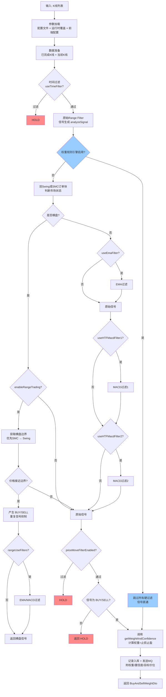

# Range Filter [DW] 策略完整文档

## 1. 策略概述

**代码位置**：`ai-signal/src/main/java/com/chain/ai/trade/engine/signal/service/support/RangeFilterDWSignServiceV1.java`

Range Filter [DW] 是一种基于价格通道（Range Filter）的趋势跟踪与反转识别策略。它通过动态计算一个自适应通道（filt ± r），结合价格相对通道的位置和方向变化，生成买入（BUY）或卖出（SELL）信号。

策略还集成了多种过滤模块（EMA、高周期MACD、双Swing横盘识别、SMC订单块横盘判断等），以提高信号的可靠性，并支持横盘市场中的边界交易模式。此外，通过 SMC（Smart Money Concepts）指标对信号进行质量评估，输出离散化权重（0, 0.5, 1.0, 1.5, 2.0）用于仓位管理。

该策略主要适用于中高频交易场景，可配置于多种K线周期。

---

## 2. 核心逻辑

### 2.1 Range Filter 计算

Range Filter 的核心是计算一个动态范围值 `r` 和一个中心滤波值 `filt`，形成上下轨：`hi_band = filt + r`，`lo_band = filt - r`。

**步骤**：

1. **输入数据**：K线序列（高、低、收盘价）。
2. **选择运动源（movementSource）**：
   - `Close`：使用收盘价计算 `mid = close`。
   - `Wicks`：使用最高价和最低价计算 `mid = (high + low) / 2`。
3. **计算真实波动范围（TR）**：`tr = max(high-low, |high-prevClose|, |low-prevClose|)`。
4. **计算平均真实范围（ATR）**：条件EMA更新 `emaAtr`，周期为 `rangePeriod`。
5. **计算平均变化（AC）**：`change = |mid - prevMid|`，条件EMA更新 `emaAc`。
6. **计算标准差（SD）**：使用SMA计算 `mid` 的标准差。
7. **计算范围值 r**：根据 `rangeScale` 选择计算方式：

   | 尺度 | 计算方式 |
   |------|----------|
   | Pips | `r = rangeQty * 0.0001` |
   | Points | `r = rangeQty * pointValue(symbol)` |
   | Ticks | `r = rangeQty * minTick(symbol)` |
   | % of Price | `r = close * rangeQty / 100` |
   | ATR | `r = rangeQty * emaAtr` |
   | Average Change | `r = rangeQty * emaAc` |
   | Standard Deviation | `r = rangeQty * sd` |

8. **平滑范围（可选）**：若 `smoothRange=true`，对 `r` 做EMA平滑，周期 `smoothPeriod`。
9. **更新滤波值 filt**（取决于 `filterType`）：

   **Type 1（传统方式）**：
   - 若 `h_val - r > prevFilt` → `newFilt = h_val - r`
   - 若 `l_val + r < prevFilt` → `newFilt = l_val + r`
   - 否则保持 `prevFilt`

   **Type 2（倍数方式）**：
   - 若 `h_val >= prevFilt + r`：`mult = floor(|h_val - prevFilt| / r)`，`newFilt = prevFilt + mult * r`
   - 若 `l_val <= prevFilt - r`：`mult = floor(|l_val - prevFilt| / r)`，`newFilt = prevFilt - mult * r`

10. **可选平均滤波变化**：若 `averageFilterChanges=true`，对 `filt`、`hi_band`、`lo_band` 做条件EMA（仅当滤波值变化时更新），周期 `averageSamples`。
11. **计算方向 fdir**：比较当前 `filt` 与上一值，>0为上升（+1），<0为下降（-1），否则延续上一方向。
12. **产生原始信号**：
    - **买入（BUY）条件**：`close > filt` 且 `close > prevClose` 且 `fdir == 1`；或者 `close > filt` 且 `close < prevClose` 且 `fdir == 1`。
    - **卖出（SELL）条件**：`close < filt` 且 `close < prevClose` 且 `fdir == -1`；或者 `close < filt` 且 `close > prevClose` 且 `fdir == -1`。
    - 同时需要满足条件变化：`longCondition = 当前满足买入条件 且 上一状态为卖出条件(prevCondIni == -1)`；`shortCondition = 当前满足卖出条件 且 上一状态为买入条件(prevCondIni == 1)`。这确保了只在趋势切换时发出信号，避免重复信号。

---

### 2.2 信号增强与过滤模块（原始硬过滤，v2.0 已由权重规则引擎替代）

> 这些过滤模块为原始硬过滤方式，**已在 v2.0 中被权重规则引擎替代**。当启用规则引擎时，以下过滤全部由规则引擎处理，不再执行传统过滤器（见第11.2节）。保留此节作为参考。

原始信号生成后，会依次通过以下可选过滤器（若启用）。任何过滤器拒绝信号，则最终输出 **HOLD**。

#### 2.2.1 EMA 趋势过滤（useEmaFilter）

计算两条EMA：`baseEma`（周期 `baseEmaPeriod`）和 `momentumEma`（周期 `momentumEmaPeriod`）。

根据 `emaFilterMode` 决定过滤条件：

| 模式 | 买入条件 | 卖出条件 |
|------|----------|----------|
| BOTH | `close > baseEma && close > momentumEma` | `close < baseEma && close < momentumEma` |
| EITHER | `close > baseEma \|\| close > momentumEma` | `close < baseEma \|\| close < momentumEma` |
| BASE_ONLY | 仅基于 `baseEma` | 仅基于 `baseEma` |
| MOMENTUM_ONLY | 仅基于 `momentumEma` | 仅基于 `momentumEma` |

#### 2.2.2 高周期 MACD 过滤（支持两组，分别配置）

从更高时间周期（如1h、15min）获取K线数据。计算MACD（fast、slow、signal）和直方图。

根据 `htfMacdFilterMode` 判断：

| 模式 | 判断条件 |
|------|----------|
| MACD_DIRECTION | 买入需 MACD线 >0，卖出需 MACD线 <0 |
| SIGNAL_DIRECTION | 买入需 信号线 >0，卖出需 信号线 <0 |
| HISTOGRAM | 买入需 直方图 >0，卖出需 直方图 <0 |
| MACD_CROSS | 买入需 MACD线 > 信号线，卖出需 MACD线 < 信号线 |

#### 2.2.3 双Swing横盘过滤与突破识别（useDualSwingFilter）

1. 在最近 `swingRecentBars` 根K线内，识别局部高低点（基于 `swingLookback`，允许相等 `swingAllowedEqual`）。
2. 计算高点平均值 `highAvg`、低点平均值 `lowAvg`、收盘价对应的高低点平均值。
3. 判断横盘：`(highAvg - lowAvg) / currentPrice < swingRangeThreshold` 且 `(closeHighAvg - closeLowAvg) / currentPrice < swingRangeThreshold`。
4. 若横盘且启用 `allowBreakoutInRanging`，检查价格是否突破 `highAvg`（向上突破）或跌破 `lowAvg`（向下突破），需要连续 `breakoutConfirmationBars` 根K线确认。
5. 横盘状态会用于后续横盘交易模式（见2.3）。

#### 2.2.4 SMC 订单块横盘判断（useSmcOrderBlockRange）

1. 获取15分钟和1小时周期的SMC订单块数据（`SmcBarResult`）。
2. 分别找到最近的多头（bias=1）和空头（bias=-1）订单块。
3. 计算供需区间之间的间隙 `gap`：
   - 若供给区起点 > 需求区终点，则为 `供给区低点 - 需求区高点`
   - 若需求区起点 > 供给区终点，则为 `需求区低点 - 供给区高点`
   - 否则间隙=0
4. 间隙百分比 = `gap / currentPrice * 100`，若 ≤ `smcRangeThresholdPercent` 则判定为横盘。
5. 横盘时返回边界：`highBound = supplyLow`，`lowBound = demandHigh`。该边界用于横盘交易模式的入场。

#### 2.2.5 时间过滤（useTimeFilter）

指定需要过滤的星期几（如 `filteredWeekdays="6"` 代表周六），当当前K线时间落在这些星期时，不产生任何信号。

#### 2.2.6 价格变动过滤（priceMoveFilterEnabled）

在信号生成的同一K线开盘时，检查开盘价相对于上一根已完成K线收盘价的涨跌幅。若买入信号且上涨超过 `priceMoveThreshold%`，或卖出信号且下跌超过 `priceMoveThreshold%`，则信号被过滤（HOLD）。

---

### 2.3 横盘交易模式（enableRangeTrading）

当市场被判定为横盘（通过双Swing或SMC订单块）且该模式启用时，策略不再产生原趋势信号，而是尝试在横盘区间的边界附近进行反向交易（低买高卖）。

**边界确定**：
- 若SMC订单块提供了边界，优先使用 `highBound`（供给区低点）和 `lowBound`（需求区高点）。
- 否则回退到双Swing分析的边界，`rangeBoundaryType` 决定使用哪种边界：

  | 类型 | 说明 |
  |------|------|
  | AVERAGE | 使用 `highAvg` / `lowAvg` |
  | SECOND_PRICE | 使用第二高点 `secondHigh` / 第二低点 `secondLow`（若无则回退平均值） |
  | RECENT | 使用最近高点 `recentHigh` / 最近低点 `recentLow` |

**入场条件**：
- 当 `currentPrice <= lowBound * (1 + rangeEntryDistance)` 时，产生 **BUY** 信号。
- 当 `currentPrice >= highBound * (1 - rangeEntryDistance)` 时，产生 **SELL** 信号。

**重复信号抑制**：对于同一交易对、相同方向、相同边界（容忍0.1%差异）的横盘信号，只会产生一次；边界变化或方向变化后才允许再次产生信号。

**可选过滤器**：若 `rangeUseFilters=true`，横盘信号也会经过EMA过滤和高周期MACD过滤（两组均可）的检验。

---

### 2.4 波动率自适应（预留）

提供 `rangeQuantityLow` 和 `rangeQuantityHigh`，以及 `atrThreshold` 和 `atrPeriodForDynamic`。可根据当前ATR与阈值比较，动态选择 `rangeQuantity`（低波动用较低量，高波动用较高量）。代码中未自动调用，但参数已预留，可在策略中集成。

---

## 3. 信号输出与权重评估

最终信号为 **BUY** 或 **SELL** 或 **HOLD**。当信号为 BUY 或 SELL 时，策略会：

1. 设置 `BuyAndSellWeightDto` 的 `buyType`。
2. 调用权重评估模块计算离散化权重（0, 0.5, 1.0, 1.5, 2.0）和动态止损止盈。
3. 发送MQ消息并记录信号入库（包含权重、置信度、目标价位），返回 `signalId`。
4. 可附加SMC订单块信息到额外参数（`attachSmcToExtraParamsIfPresent`）。

权重计算模块位于 `DefaultSignService.getWeightAndConfidence()`，`RangeFilterDWSignServiceV1` 继承并使用该逻辑。以下第4章详细说明权重计算。

---

## 4. 权重与置信度计算（SMC 增强模块）

本策略通过 SMC（Smart Money Concepts）指标对信号进行质量评估，输出权重与置信度，用于仓位管理、风险控制和信号排序。

> **🔄 v3.0 变更**：启用权重规则引擎时，SMC 权重计算由权重规则引擎**完全接管**，第4.3~4.10节描述的硬编码评分逻辑不再执行。规则引擎通过细粒度的 SMC 指标（趋势极性、趋势强度、15min/1h 位置分、OB内标志、风险百分比、收益点数、EMA评分）让用户自定义评分/否决规则。详见第[11.2节](#112-权重规则配置v20-已实现)及第11.2.3节新增的 SMC 指标类型。
>
> 以下第4.3~4.10节为**传统硬编码路径**的说明，保留作为参考，仅在规则引擎未启用时生效。

---

### 4.1 概述

权重计算基于以下维度的综合评分：

> **v3.0**：启用规则引擎时，以下维度不再由硬编码逻辑计算，而是通过细粒度 SMC 指标（见第11.2.3节）由规则引擎自定义评估。以下为传统路径说明。

- **趋势分**：根据15分钟和1小时周期的SMC内部/摆动趋势识别结果，判断当前信号是否为顺势。
- **位置分**：评估当前价格相对于最近的需求区（做多）或供给区（做空）的位置，价格越靠近有利区域得分越高。
- **盈亏比与风险**：动态计算止损和止盈价位，评估净盈亏比，并根据绝对风险大小进行奖励/惩罚。
- **横盘市场限制**：当市场处于横盘状态时，最大权重被限制为1.0，避免在震荡市中过度加仓。
- **EMA多周期过滤（可选）**：可引入15分钟、1小时、4小时、日线的EMA排列得分，进一步增强权重区分度（代码中默认关闭，可通过配置开启）。

最终权重被离散化为档位：**0, 0.5, 1.0, 1.5, 2.0**，其中0表示信号无效，2.0表示最强信号。

**v3.0 规则引擎路径**：启用规则引擎时，系统从 SMC 快照数据中提取9个细粒度指标（趋势极性、趋势强度、15min位置分、1h位置分、OB内标志、风险百分比、收益点数、EMA评分、方向一致度），填充到 `WeightRuleContext`，由用户配置的评分/否决规则决定最终权重。止损止盈目标计算仍复用原逻辑（仅取价位，不取评分）。

---

### 4.2 SMC 数据获取

权重计算依赖以下SMC快照数据（通过 `computeSmcSnapshot` 方法获取）：

- 15分钟SMC数据（OKXMIN15）
- 1小时SMC数据（OKXMIN60）

每个快照包含：

- 内部趋势（`internalTrend`）和摆动趋势（`swingTrend`）：数值 +1（看涨）、-1（看跌）或 0（震荡）
- 内部订单块（`internalOrderBlocks`）和摆动订单块（`swingOrderBlocks`）：每个订单块包含 `high`、`low`、`time` 和 `bias`（+1 需求区，-1 供给区）
- 折扣区（`discountZoneTop` / `discountZoneBottom`）：买方有利区域
- 溢价区（`premiumZoneTop` / `premiumZoneBottom`）：卖方有利区域
- 追踪高低点（`trailingHigh` / `trailingLow`）：近期显著高低点

---

### 4.3 趋势分计算

#### 4.3.1 识别趋势类型

通过 `SmcTrendUtils.identifyTrendType(h1Swing, h1Internal, m15Swing, m15Internal)` 将多周期SMC趋势综合为以下类型之一：

| 趋势类型 | 极性 | 基础强度 |
|----------|------|----------|
| STRONG_BULLISH | 看涨 (+1) | 1.5 |
| STRONG_BEARISH | 看跌 (-1) | 1.5 |
| BULLISH_PULLBACK | 看涨 (+1) | 0.5 |
| BEARISH_PULLBACK | 看跌 (-1) | 0.5 |
| POTENTIAL_BOTTOM | 看涨 (+1) | 2.0 |
| POTENTIAL_TOP | 看跌 (-1) | 2.0 |
| RANGING / CHAOTIC | 中性 (0) | 0 |

#### 4.3.2 趋势分

- 若信号方向与趋势极性一致（顺势），则趋势分 = 基础强度。
- 若信号方向与趋势极性相反（逆势），则趋势分 = 0。
- 范围：0 ~ 2.0。

---

### 4.4 位置分计算

位置分评估当前价格相对于最近的需求区（做多）或最近供给区（做空）的位置。位置分范围为 **-2.0 ~ +2.0**。

#### 4.4.1 寻找最近的订单块

1. 合并15分钟和1小时的所有订单块（内部 + 摆动）。
2. 筛选出 `bias` 与信号方向一致的订单块：做多需要需求区（bias = +1），做空需要供给区（bias = -1）。
3. 选择距离当前价格距离比例最小的订单块作为参考块。

**距离比例定义**：
- 若 `price < low`：`距离 = (low - price) / (high - low)`
- 若 `price > high`：`距离 = (price - high) / (high - low)`
- 若在区域内：`距离 = 0`

#### 4.4.2 得分规则

| 情况 | 做多 (BUY) | 做空 (SELL) |
|------|-----------|------------|
| 价格在区域内 | `1.0 + (1 - 区域内部相对位置) * 1.0` → 越接近低点分越高 [1.0, 2.0] | `1.0 + 区域内部相对位置 * 1.0` → 越接近高点分越高 [1.0, 2.0] |
| 价格在区域下方 | 有利：距离比例映射到 [0, 1.0] | 不利：`-0.5 * 距离比例` → [-0.5, 0] |
| 价格在区域上方 | 不利：`-0.5 * 距离比例` → [-0.5, 0] | 有利：距离比例映射到 [0, 1.0] |

**最终位置分** = `15分钟得分 × 0.4 + 1小时得分 × 0.6`。

> 若价格处于严重不利位置（得分 ≤ -1.5），则直接拒绝信号（权重设为0）。

---

### 4.5 止损与止盈目标计算

使用 `computeSmcTargetsUsingExitAlgorithm` 方法动态确定止损和止盈价。

#### 4.5.1 止损计算

优先级（以做多为例，做空对称）：

1. **15分钟内部订单块**：从最近的需求区（bias=+1）获取低点，减去缓冲 `buffer = currentPrice × 0.005`。
2. 回退到15分钟折扣区底部或追踪低点：`discountZoneBottom` 或 `trailingLow`。
3. **1小时级别**：优先使用1小时的内部订单块需求区低点，否则使用其折扣区底部或追踪低点。
4. **绝对保底**：若仍未获取到，止损设为 `currentPrice × 0.99`（做多）或 `currentPrice × 1.01`（做空）。

#### 4.5.2 止盈计算

优先级（做多为例，做空对称）：

1. **15分钟内部订单块供给区低点**（bias=-1）。
2. **15分钟溢价区底部**（`premiumZoneBottom`）或追踪高点（`trailingHigh`）。
3. **1小时级别**：供给区低点或溢价区底部。
4. **保底**：做多取 `currentPrice × 1.02`，做空取 `currentPrice × 0.98`。

**潜在反转信号优化**：当趋势类型为 `POTENTIAL_BOTTOM`（做多）或 `POTENTIAL_TOP`（做空）时，止盈会采用最远目标：取所有可用供给区低点（做多）或需求区高点（做空）中的极值，以捕捉更大盈亏比。

---

### 4.6 盈亏比与风险调整

#### 4.6.1 净盈亏比

```
净盈亏比 = (reward - fee) / (risk + fee)
```

其中：
- `fee = currentPrice × 0.001`（模拟交易费用）
- `risk = |currentPrice - stopLoss|`
- `reward = |takeProfit - currentPrice|`

> 最小允许净盈亏比：**1.2**，低于此值信号被拒绝（权重为0）。

#### 4.6.2 风险规模调整因子

定义最大可接受风险为当前价格的 2%（`maxRisk = currentPrice × 0.02`）。

- 若 `risk ≤ maxRisk`：`riskScale = 1 + (maxRisk - risk) / maxRisk × 0.2`（范围 [1.0, 1.2]）
- 若 `risk > maxRisk`：`riskScale = max(0.6, 1 - (risk - maxRisk) / maxRisk × 0.4)`（范围 [0.6, 1.0]）

> 风险越小，奖励系数越高，鼓励使用紧凑止损。

---

### 4.7 综合权重计算与离散化

#### 4.7.1 原始连续权重

```
rawWeight = (趋势分 + 位置分 + EMA分) × 0.625
```

范围被限制在 `[0, 2.5]`。EMA分 默认为0（代码中默认未启用），可通过配置开启多周期EMA评分。

#### 4.7.2 盈亏比奖励

```
rrBonus = min(1.5, 1 + (netRR - minRR) × 0.5)
```

`minRR = 1.2`，若净盈亏比越高，奖励系数越高（上限1.5）。

#### 4.7.3 最终连续权重

```
finalWeightContinuous = rawWeight × rrBonus × riskScale
```

再次限制 ≤ 2.5。

#### 4.7.4 离散化

| 连续值范围 | 离散权重 |
|-----------|----------|
| < 0.25 | 0 |
| 0.25 ~ 0.75 | 0.5 |
| 0.75 ~ 1.25 | 1.0 |
| 1.25 ~ 1.75 | 1.5 |
| ≥ 1.75 | 2.0 |

> 若信号被任何条件拒绝（趋势分=0、位置分过低、盈亏比不足等），离散权重为0。

---

### 4.8 置信度

当前版本置信度固定为 **0.5（50%）**，未根据信号质量动态调整。预留接口可供后续扩展。

---

### 4.9 横盘市场特殊处理

当 `calcDto.getMarketTrend()` 为 "RANGING" 时（由 `applyAllFilters` 中的SMC或Swing横盘判断设置）：

- **综合得分计算公式改变**：`totalScore = trendScore + (positionScore < 0 ? positionScore : 0) + emaScore`，即只惩罚不利的位置分，不奖励有利位置分。
- **最大权重限制**：`finalWeight = min(finalWeight, 1.0)`，即横盘市中权重最高为1.0，避免在无明显趋势时过度交易。

---

### 4.10 权重计算完整流程图

```mermaid
flowchart TD
    A[SMC 快照数据<br/>15min + 1h] --> WRE{权重规则引擎启用?}
    WRE -->|是| R1[填充细粒度SMC指标到<br/>WeightRuleContext<br/>- 趋势极性/强度<br/>- 15min/1h位置分<br/>- OB内标志<br/>- 风险百分比/收益<br/>- EMA评分]
    R1 --> R2[权重规则引擎评估<br/>按配置的评分/否决规则<br/>累加总分]
    R2 --> R3{命中否决规则?}
    R3 -->|是| R4[返回否决权重<br/>通常 0.2]
    R3 -->|否| R5[评分总和映射离散权重<br/>≥3.5→2.0 / ≥2.5→1.5<br/>≥1.5→1.0 / ≥0.5→0.5]
    R4 --> R6[最终离散权重]
    R5 --> R6

    WRE -->|否/传统路径| B[趋势分计算<br/>identifyTrendType]
    A --> C[位置分计算<br/>最近订单块距离评分]
    A --> D[止损止盈计算<br/>computeSmcTargetsUsingExitAlgorithm]
    B --> E[趋势分: 0~2.0<br/>顺势=基础强度, 逆势=0]
    C --> F[位置分: -2.0~2.0<br/>15min×0.4 + 1h×0.6]
    D --> G[净盈亏比 netRR<br/>risk, reward, fee]
    G --> H{netRR ≥ 1.2?}
    H -->|否| I[权重=0, 拒绝]
    H -->|是| J[风险调整因子 riskScale]
    J --> K[rawWeight = (趋势分+位置分+EMA分)×0.625]
    K --> L[rrBonus = min(1.5, 1+(netRR-1.2)×0.5)]
    L --> M[finalWeightContinuous = rawWeight × rrBonus × riskScale]
    M --> N[限制 ≤ 2.5]
    N --> O[离散化]
    O --> P{finalWeightContinuous}
    P -->|< 0.25| Q[离散权重 = 0]
    P -->|0.25~0.75| R[离散权重 = 0.5]
    P -->|0.75~1.25| S[离散权重 = 1.0]
    P -->|1.25~1.75| T[离散权重 = 1.5]
    P -->|≥ 1.75| U[离散权重 = 2.0]
    style I fill:#f88
    style Q fill:#f88
    style WRE fill:#9cf
    style R1 fill:#9cf
    style R2 fill:#9cf
```

---

## 5. 策略参数说明

### 5.1 Range Filter 核心参数

| 参数名 | 类型 | 默认值 | 说明 |
|--------|------|--------|------|
| filterType | String | Type 1 | 滤波值更新方式：Type 1 或 Type 2 |
| movementSource | String | Close | 计算mid的数据源：Close 或 Wicks |
| rangeQuantity | double | 1.618 | 范围乘数（基础值） |
| rangeScale | String | Average Change | 范围计算尺度：Pips, Points, Ticks, % of Price, ATR, Average Change, Standard Deviation |
| rangePeriod | int | 21 | 计算ATR/AC/SD的周期 |
| smoothRange | boolean | true | 是否对范围值r做EMA平滑 |
| smoothPeriod | int | 27 | 平滑周期 |
| averageFilterChanges | boolean | true | 是否对滤波值做平均处理（仅当变化时） |
| averageSamples | int | 2 | 平均处理的样本数 |

### 5.2 EMA 过滤参数（已移除，由 v2.0 权重规则引擎完全替代）

> 🗑️ **v3.0 已移除**：EMA 过滤参数已从 **Range Filter DW (V1)** 的前端配置中删除。旧硬过滤代码已清理，统一由权重规则引擎的 `EMA` 指标替代。
>
> 配置方式：在权重规则中添加 `EMA(period) > 1.0`（多头）或 `EMA(period) < 1.0`（空头）条件的规则。详见 [11.2 权重规则配置](#112-权重规则配置v20-已实现)。
>
> 其他信号服务类（如 `RangeFilterDWSignService`、`OptimizedRangeFilterDWSignService`）仍保留旧 EMA 过滤代码，不受本次变更影响。

### 5.3 高周期 MACD 过滤参数（旧版硬过滤，v2.0 已由权重规则引擎替代）

| 参数名 | 类型 | 默认值 | 说明 |
|--------|------|--------|------|
| useHTFMacdFilter1/2 | boolean | false | 是否启用该组MACD过滤 |
| htfMacdResolution1/2 | String | 60 / 15 | K线周期（分钟数） |
| htfMacdFast1/2 | int | 12 | MACD快线周期 |
| htfMacdSlow1/2 | int | 26 | MACD慢线周期 |
| htfMacdSignal1/2 | int | 9 | MACD信号线周期 |
| htfMacdFilterMode1/2 | String | HISTOGRAM | 判断模式 |

> **⚠️ 高周期与当前时间帧差异**：原硬过滤从**更高时间周期**（如60min、15min）获取K线计算MACD。规则引擎当前使用**信号自身时间帧的K线**计算（复用 `ctx.getKLines()`）。两者在MACD计算结果上可能有差异，尤其在信号周期较短的场景下。后续计划在 `WeightRuleContext` 中添加多分辨率K线支持，通过规则参数 `resolution` 指定高周期数据源。详见[后续改进](#12-后续改进计划)。

### 5.4 双Swing横盘过滤与突破

| 参数名 | 类型 | 默认值 | 说明 |
|--------|------|--------|------|
| useDualSwingFilter | boolean | true | 是否启用双Swing横盘识别 |
| swingLookback | int | 3 | 寻找摆点时的左右回溯K线数 |
| swingAllowedEqual | int | 0 | 允许连续相等值的数量 |
| swingRecentBars | int | 55 | 用于分析横盘的最近K线数量 |
| swingRangeThreshold | double | 0.04 | 横盘判断阈值（4%振幅） |
| allowBreakoutInRanging | boolean | true | 是否在横盘中允许突破信号 |
| breakoutConfirmationBars | int | 1 | 突破确认所需K线根数 |

### 5.5 SMC 订单块横盘判断

| 参数名 | 类型 | 默认值 | 说明 |
|--------|------|--------|------|
| useSmcOrderBlockRange | boolean | true | 是否使用SMC订单块判断横盘 |
| smcRangeThresholdPercent | double | 2.0 | 订单块间隙阈值（百分比） |

### 5.6 横盘交易模式

| 参数名 | 类型 | 默认值 | 说明 |
|--------|------|--------|------|
| enableRangeTrading | boolean | true | 是否在横盘时启用边界交易 |
| rangeEntryDistance | double | 0.001 | 距离边界的容忍距离（相对值） |
| rangeUseFilters | boolean | false | 横盘信号是否也通过EMA/MACD过滤 |
| rangeBoundaryType | String | AVERAGE | 边界类型：AVERAGE, SECOND_PRICE, RECENT |

### 5.7 其他过滤（旧版硬过滤，v2.0 已由权重规则引擎替代）

| 参数名 | 类型 | 默认值 | 说明 |
|--------|------|--------|------|
| useTimeFilter | boolean | false | 是否启用时间过滤 |
| filteredWeekdays | String | 6 | 过滤的星期（1=周一…7=周日） |
| priceMoveFilterEnabled | boolean | false | 是否启用价格变动过滤 |
| priceMoveThreshold | double | 2.0 | 价格变动阈值（百分比） |

### 5.8 风险与权重模块内部参数（已支持前端配置）

> 下方参数原为 `DefaultSignService.evaluateSmcSignal()` 中的硬编码值，现已在信号服务管理界面中提供配置（分组 `smcWeight`），可通过前端或后端 API 动态调整。

| 参数名 | 说明 | 默认值 |
|--------|------|--------|
| smcStopLossOffset | 止损缓冲比例 | 0.005 |
| smcMinTargetSpaceRatio | 最小目标空间比例 | 0.005 |
| maxRiskPercent | 最大可接受风险百分比 | 2.0 |
| minRR | 最小净盈亏比 | 1.2 |
| useEmaScore | 是否启用 EMA 多周期评分 | false |

### 5.9 动态波动率参数（预留）

| 参数名 | 类型 | 默认值 | 说明 |
|--------|------|--------|------|
| rangeQuantityLow | double | 1.618 | 低波动时的乘数 |
| rangeQuantityHigh | double | 2.618 | 高波动时的乘数 |
| atrThreshold | double | 0.8 | ATR阈值 |
| atrPeriodForDynamic | int | 30 | 动态ATR计算周期 |

---

## 6. 策略执行流程



---

## 7. 注意事项

- **数据依赖**：策略需要至少 `rangePeriod + smoothPeriod + 5` 根已完成K线，以及可能的高周期K线数据（若启用MACD过滤）。权重计算额外需要15分钟和1小时SMC快照，需要确保SMC数据服务可用。
- **SMC订单块数据**：需要外部服务提供 `SmcBarResult`（15分钟和1小时），否则权重计算会因数据不足而跳过（返回权重0）。
- **点值与最小跳动**：若使用 Points 或 Ticks 尺度，需要实现 `PointValueProvider` 接口，否则使用默认值（可能不准确）。
- **横盘模式下的信号抑制**：使用 `ConcurrentHashMap` 存储每个交易对最近一次横盘信号（方向、边界、时间），相同边界内不会重复发出同向信号。
- **性能**：策略在每根K线执行时，会对过去 `swingRecentBars`（默认55根）K线重复计算Swing点，可能较消耗资源，建议合理设置该值。权重计算中的SMC快照获取也有一定开销。
- **权重为零的信号**：即使原始Range Filter产生BUY/SELL，若SMC评估不通过（趋势不符、位置差、盈亏比不足等），最终权重将为0，信号仍会入库但权重为0，上层策略应据此管理仓位或不交易。已实现的权重规则引擎（v2.0）通过可配置的评分/否决规则进一步增强了评分与否决能力（详见第11.2节）。

---

## 8. 扩展与定制

- 可动态传递 `parameterOverrides`（`Map<String, String>`）覆盖任何参数，适用于回测或A/B测试。
- 可通过 `SignalServiceConfigService` 从数据库加载预设参数组（key = `RangeFilterDWSignService`）。
- 可自定义 `PointValueProvider` 来提供精确的品种点值和最小变动单位。
- 权重计算中的EMA评分、风险参数等可通过继承 `DefaultSignService` 或配置启用。
- 前端配置扩展：所有参数（包括Range Filter核心参数、过滤开关）均可通过前端管理界面动态配置，无需重启服务。权重规则引擎（v2.0 已实现）通过信号服务管理界面的规则编辑对话框配置评分/否决规则，详见第11.2节。

---

## 9. 示例配置（application.yml）

```yaml
strategy:
  rfdw:
    filter-type: "Type 1"
    movement-source: "Close"
    range-quantity: 1.618
    range-scale: "Average Change"
    range-period: 21
    smooth-range: true
    smooth-period: 27
    average-filter-changes: true
    average-samples: 2
    use-ema-filter: true
    base-ema-period: 60
    momentum-ema-period: 26
    ema-filter-mode: "BOTH"
    use-htf-macd-filter1: true
    htf-macd-resolution1: "60"
    htf-macd-fast1: 12
    htf-macd-slow1: 26
    htf-macd-signal1: 9
    htf-macd-filter-mode1: "HISTOGRAM"
    use-dual-swing-filter: true
    swing-lookback: 3
    swing-recent-bars: 55
    swing-range-threshold: 0.04
    enable-range-trading: true
    range-entry-distance: 0.001
    range-boundary-type: "AVERAGE"
    use-smc-orderblock-range: true
    smc-range-threshold-percent: 2.0
    price-move-filter-enabled: false
    price-move-threshold: 2.0
```

---

## 10. 变更日志

| 版本 | 说明 |
|------|------|
| v1.0 | 初始版本：整合Range Filter [DW]与多种过滤模块，支持横盘交易与SMC订单块横盘判断 |
| v1.1 | 增加基于SMC的权重与置信度计算模块，输出离散化权重（0~2）和动态止损止盈 |
| v1.2 | 增加前端管理界面配置能力，支持动态参数调整 |
| v2.0（已实现） | 增加权重规则引擎（评分/否决模式），支持前端可视化配置规则条件；传统硬过滤（EMA、MACD、价格变动等）在启用规则引擎后全部交由规则引擎处理，详见第11.2节 |
| v3.0（已实现） | SMC权重计算完全由权重规则引擎接管：新增9个细粒度SMC指标（趋势极性/强度、15min/1h位置分、OB内标志、风险百分比、收益点数、EMA评分、方向一致度），支持通过规则引擎自定义SMC评分逻辑替代硬编码路径；启用规则引擎后，第4.3~4.10节的传统SMC硬编码逻辑不再执行 |

---

## 11. 前端管理界面配置指南

为了降低策略调整门槛、实现参数动态生效，系统提供了前端管理界面。以下介绍现有功能及 v2.0 已实现的权重规则配置扩展。

---

### 11.1 现有参数配置界面

当前前端管理界面已支持以下基础配置：

```
信号服务管理
├── 服务配置
│   ├── 配置列表
│   │   ├── 服务类: RangeFilterDWSignService
│   │   ├── 配置名称: V1
│   │   ├── 状态: 启用
│   │   └── 更新时间: 2026-03-18 17:56:31
│   └── 参数配置
│       ├── 过滤类型: Type 1
│       ├── 价格来源: Close
│       ├── 范围倍数: 2.618
│       ├── 范围尺度: Average Change
│       ├── 范围周期: 14
│       ├── 平滑范围: ☑
│       ├── 平滑周期: 27
│       ├── 平均变化: ☑
│       ├── 平均样本数: 2
│       ├── 详细日志: ☐
│       └── 启用EMA过滤: ☑ ...
```

用户可通过该界面修改 Range Filter 的核心参数（过滤类型、价格来源、范围倍数、范围尺度、范围周期、平滑开关、平滑周期、平均变化开关、平均样本数等），以及控制详细日志和EMA过滤等开关。

> **⚠️ 当前已知问题**：后端 `SERVICE_DEFINITIONS` 仅暴露了约 26 个参数，但 `applyConfiguredParams()` 实际加载 50+ 个参数。缺失的参数包括双Swing横盘（useDualSwingFilter 等）、横盘交易模式（enableRangeTrading 等）、SMC订单块横盘（useSmcOrderBlockRange 等）、价格变动过滤（priceMoveFilterEnabled 等）、动态波动率（rangeQuantityLow 等）等模块的全部参数。详见第12章改进计划 P1。

---

### 11.2 权重规则配置（v2.0 已实现）

为将传统的"硬过滤"转变为"软评分"，前端增加"权重规则配置"模块，允许用户自定义评分规则和否决规则。UI 实现为**对话框（Dialog）形式**，通过配置页面底部的摘要入口打开。

#### 11.2.1 规则入口与摘要展示

在参数配置区域底部，增加一个**快捷入口卡片**，显示规则引擎启用状态和规则数量，点击后打开完整的规则编辑对话框：

```
┌──────────────────────────────────────────────────────────┐
│ ⚙ 权重规则                              [启用, 3条规则]    │
│                                                            │
│ 引擎开关: ● 已启用  │  评分规则: 2条  │  否决规则: 1条    │
│                                                            │
│                            [点击配置权重规则 ➔]            │
└──────────────────────────────────────────────────────────┘
```

#### 11.2.2 规则编辑对话框

点击入口后，打开完整对话框进行规则编辑（以 EMA 趋势过滤为例）：

```
┌──────────────────────────────────────────────┐
│ 新增规则                             [×]      │
├──────────────────────────────────────────────┤
│ 规则名称: [EMA趋势过滤_BUY方向_______]         │
│ 规则类型: ● 否决项                            │
│ 否决后权重: [0.2____]                         │
│                                               │
│ 条件组合:                                     │
│   [全部满足(ALL)▼]                            │
│                                               │
│ ┌─────────────────────────────────────────┐   │
│ │ 条件1: 指标 [EMA▼]  周期 [60]            │   │
│ │        运算符 [<=▼]  预期值 [1.0]         │   │
│ │                                [删除]    │   │
│ ├─────────────────────────────────────────┤   │
│ │ 条件2: 指标 [EMA▼]  周期 [26]            │   │
│ │        运算符 [<=▼]  预期值 [1.0]         │   │
│ │                                [删除]    │   │
│ └─────────────────────────────────────────┘   │
│                            [+ 添加条件]        │
│                                               │
│             [取消]             [保存]          │
└──────────────────────────────────────────────┘
```

> **EMA 指标说明**：`EMA(period)` 返回 `收盘价 / EMA(period)` 的比值。比值 > 1.0 表示收盘价在均线上方，< 1.0 表示在均线下方。因此用 `EMA > 1.0` 来替代 `close > ema` 的判断。

#### 11.2.3 支持的指标与条件类型

| 指标类型 | 可配置参数 | 说明 | 实现状态 |
|----------|-----------|------|---------|
| CLOSE | - | 当前K线收盘价 | ✅ 已实现 |
| OPEN | - | 当前K线开盘价 | ✅ 已实现 |
| HIGH / LOW | - | 当前K线最高/最低价 | ✅ 已实现 |
| EMA | `period`（周期，默认60） | 返回 `收盘价 / EMA(period)` 的比值。>1.0 表示在均线上方 | ✅ 已实现（复用 ta4j EMAIndicator） |
| MACD_LINE | `fast`(默认12), `slow`(默认26) | MACD线值（快EMA - 慢EMA），对应 MACD_DIRECTION 模式。>0 表示多头，<0 表示空头 | ✅ 已实现（复用 ta4j MACDIndicator） |
| MACD_HISTOGRAM | `fast`, `slow`, `signal`(默认9) | MACD柱状图值（MACD线 - 信号线），对应 HISTOGRAM / MACD_CROSS 模式。>0 表示多头 | ✅ 已实现（复用 ta4j MACDIndicator） |
| MACD_SIGNAL | `fast`, `slow`, `signal`(默认9) | MACD信号线值（MACD线的EMA），对应 SIGNAL_DIRECTION 模式 | ✅ 已实现（复用 ta4j MACDIndicator） |
| PRICE_MOVE | - | 当前开盘相对于前收盘涨跌幅 | ⚠️ 已实现，但语义为"首根→末根收盘变动" |
| TIME | - | 当前K线的时间戳 | ✅ 已实现（含 weekday 星期解析），无上下文时返回毫秒值 |
| SMC_TREND_SCORE | - | SMC趋势评分（0~2），传统路径聚合值 | ✅ 已实现 |
| SMC_POSITION_SCORE | - | SMC位置评分（-2~2），传统路径聚合值 | ✅ 已实现 |
| SMC_RR | - | SMC净盈亏比，传统路径聚合值 | ✅ 已实现 |
| SMC_TREND_POLARITY | - | SMC趋势极性：1=看涨, -1=看跌, 0=中性（v3.0 新增细粒度指标） | ✅ 已实现 |
| SMC_TREND_STRENGTH | - | SMC趋势强度：2=反转, 1.5=强趋势, 0.5=回调, 0=横盘/混沌（v3.0 新增细粒度指标） | ✅ 已实现 |
| SMC_POSITION_15M | - | SMC 15min位置评分（-2~2）（v3.0 新增细粒度指标） | ✅ 已实现 |
| SMC_POSITION_1H | - | SMC 1h位置评分（-2~2）（v3.0 新增细粒度指标） | ✅ 已实现 |
| SMC_INSIDE_OB | - | 当前价格是否在订单块内部：1=在内部, 0=不在（v3.0 新增细粒度指标） | ✅ 已实现 |
| SMC_RISK_PERCENT | - | 止损距离占当前价格的百分比（v3.0 新增细粒度指标） | ✅ 已实现 |
| SMC_REWARD_POINTS | - | 止盈到当前价格的绝对点数（v3.0 新增细粒度指标） | ✅ 已实现 |
| SMC_EMA_SCORE | - | EMA多周期综合评分（v3.0 新增细粒度指标） | ✅ 已实现 |
| SMC_DIRECTION_ALIGNED | - | 信号方向与趋势方向一致度：1=一致, -1=相反, 0=中性（v3.0 新增，自动适配多空方向） | ✅ 已实现 |
| TREND_DIRECTION | - | 趋势方向枚举 | 🚫 已定义，后端未实现取值 |
| SWING_RANGING | - | 基于双Swing点分析的横盘识别。1.0=横盘, 0.0=趋势 | ✅ 已实现（使用 `enrichWeightRuleContext` hook 预计算） |
| SWING_BREAKOUT | - | Swing横盘中的突破方向。1=向上突破, -1=向下突破, 0=无突破 | ✅ 已实现（含 `breakoutConfirmationBars` 确认逻辑） |
| SMC_OB_RANGING | - | 基于SMC 15min/1h订单块的横盘判断。1.0=横盘, 0.0=趋势 | ✅ 已实现（使用 `enrichWeightRuleContext` hook 预计算） |
| WEEKDAY | - | 星期几，1=周一 … 7=周日 | ✅ 已实现（使用 `enrichWeightRuleContext` hook 预计算） |

支持的运算符：`>`, `>=`, `<`, `<=`, `==`, `!=`（✅ 已实现）；`cross_above`, `cross_below`, `in`（🚫 已定义，后端未实现）

#### 11.2.4 规则执行逻辑

- **评分项（SCORING）**：当条件满足时，在总分上加上配置的分值（可为正或负）。
- **否决项（VETO）**：当条件满足时，直接使最终权重为配置的 `vetoWeight`（通常为0），不再继续评估后续规则。
- 规则按配置顺序依次执行，否决项可提前终止。
- 若无任何否决项，则所有评分项的得分累加，最终经过归一化和离散化得到权重。

#### 11.2.5 与原有硬过滤的兼容

- **启用条件**：通过 `WeightRuleConfig.enabled` 字段控制。当 `enabled=true` 时规则引擎激活，否则回退原有逻辑。
- **架构变更**：启用规则引擎后，`RangeFilterDWSignServiceV1.execute()` 主流程中的 `applyAllFilters()`（EMA、MACD、双Swing、SMC订单块横盘）和 `applyPriceMoveFilter()` 全部跳过；`handleRangeTrading()` 中的 `rangeUseFilters` 判断也增加 `&& !isWeightRuleEngineEnabled()` 保护。信号生成后直接进入 `getWeightAndConfidence()` 进行规则评估。
- **SMC 权重计算路径变更（v3.0）**：启用规则引擎后，`getWeightAndConfidence()` 不再执行传统的 `evaluateSmcSignal()` 硬编码评分逻辑，而是填充9个细粒度 SMC 指标到 `WeightRuleContext`（趋势极性/强度、15min/1h位置分、OB内标志、风险百分比、收益点数、EMA评分、方向一致度），交由权重规则引擎独立评估。SL/TP 目标计算仍复用 `evaluateSmcSignal()` 的结果（仅取止损止盈价位，不取评分）。
- **回退机制**：当未配置规则、规则未启用或规则引擎返回 `null` 时，系统自动回退到原有 `evaluateSmcSignal()` 逻辑，确保向下兼容。
- **`DefaultSignService` 集成**：`isWeightRuleEngineEnabled()` 方法检查当前服务是否配置了启用的权重规则，该方法由子类（如 `RangeFilterDWSignServiceV1`）继承使用，在多个流程节点做分支判断。

---

### 11.3 后端 API 设计

权重规则集成在信号服务配置管理中，与原有参数共用同一套配置 CRUD 接口。规则数据作为配置对象的一个字段（`weightRules`）整体保存和读取。

| 端点 | 方法 | 说明 |
|------|------|------|
| `/api/signal-service/configs` | POST | 创建/保存配置（`weightRules` 字段作为 `WeightRuleConfig` JSON 对象传入，后端序列化为 `weightRulesJson` 存储） |
| `/api/signal-service/configs` | GET | 获取配置列表（返回中包含 `weightRules` 字段，由 `toResponse()` 反序列化回 `WeightRuleConfig` 对象） |
| `/api/signal-service/configs/{id}` | GET | 获取单个配置详情 |
| `/api/signal-service/configs/{id}` | PUT | 更新配置 |
| `/api/signal-service/configs/{id}` | DELETE | 删除配置 |

**关键实现细节**：

- **`SignalServiceConfigRequest`** 包含 `weightRules` 字段（`WeightRuleConfig` 类型），`saveConfig()` 中当该字段非空时调用 `objectMapper.writeValueAsString()` 序列化为 JSON 字符串写入 `weight_rules_json` 列。
- **`toResponse()`** 回显时：若 `weight_rules_json` 非空，调用 `objectMapper.readValue()` 反序列化为 `WeightRuleConfig` 对象，放入响应的 `weightRules` 字段返回前端。
- 权重规则无需单独的 CRUD 端点，与配置同生命周期。**不提供独立的测试规则端点**（v2.0 一期未实现）。

---

### 11.4 数据存储

配置存储于数据库 `signal_service_config` 表，相关字段如下：

| 字段名 | 类型 | 说明 |
|--------|------|------|
| `id` | bigint | 主键 |
| `name` | varchar(100) | 配置名称 |
| `service_key` | varchar(100) | 服务标识（如 `RangeFilterDW`） |
| `enabled` | tinyint(1) | 启用状态（1=启用, 0=禁用） |
| `params_json` | json | 参数配置JSON（存储Range Filter核心参数、过滤开关等扁平键值对） |
| `weight_rules_json` | json | 权重规则JSON（存储 `WeightRuleConfig` 嵌套对象，包含 `enabled` 开关和 `rules` 规则列表） |
| `created_at` | datetime | 创建时间 |
| `updated_at` | datetime | 更新时间 |

> **`params_json` 与 `weight_rules_json` 的区别**：`params_json` 存储扁平的KV参数（如 `useEmaFilter=true`、`rangeQuantity=1.618`），而 `weight_rules_json` 存储嵌套的规则树结构（包含规则类型、条件组合、运算符等）。两者不重复，各自独立存储和解析。

**DDL 变更**：`weight_rules_json` 列通过迁移脚本 [add_weight_rules_json_column.sql](file:///f:/project/lenzeto/docs/db/add_weight_rules_json_column.sql) 添加到现有 `signal_service_config` 表，属于表结构扩展，非新建表。当前版本未实现配置历史版本管理。

---

### 11.5 前端配置优势

- **动态生效**：配置保存后通过消息通知（如Redis Pub/Sub）或定时刷新，策略服务实时加载新配置，无需重启。
- **降低开发成本**：交易员可自行调整评分规则和否决条件，快速应对市场变化。
- **A/B测试友好**：可为不同机器人、不同交易对分配不同配置，比较效果。
- **可审计**：所有配置变更记录入库，便于回溯和复盘。

---

### 11.6 后续可扩展方向

- 增加更多内置指标（RSI、布林带、成交量等）
- 支持多周期联合条件（如15分钟EMA>1小时EMA）
- 提供规则模板库（如"经典趋势过滤"、"高盈亏比交易"等一键应用）
- 增加可视化回测界面，模拟规则在历史数据上的表现

---

## 12. 改进开发计划

以下为基于当前系统对比分析后整理的改进计划，按优先级排序。

> **状态标注说明**：
> - 🟢 **待开始**：尚未开发
> - 🟡 **进行中**：正在开发
> - ✅ **已完成**：已开发完毕
> - ⏸️ **暂停**：暂缓
> - 📅 **已规划**：已排期但未开始

---

### P1 — 后端定义补全（高优先级）

**目标**：补齐 `SignalServiceController.SERVICE_DEFINITIONS` 中缺失的 24 个参数定义，使前端可配置完整参数集。

| # | 任务 | 涉及文件 | 状态 |
|---|------|----------|------|
| 1.1 | 双Swing横盘参数：`useDualSwingFilter`, `swingLookback`, `swingAllowedEqual`, `swingRecentBars`, `swingRangeThreshold`, `allowBreakoutInRanging`, `breakoutConfirmationBars` | `SignalServiceController.java` | 🟢 **已完成** |
| 1.2 | 横盘交易模式参数：`enableRangeTrading`, `rangeEntryDistance`, `rangeUseFilters`, `rangeBoundaryType` | `SignalServiceController.java` | 🟢 **已完成** |
| 1.3 | SMC订单块横盘参数：`useSmcOrderBlockRange`, `smcRangeThresholdPercent` | `SignalServiceController.java` | 🟢 **已完成** |
| 1.4 | 价格变动过滤参数：`priceMoveFilterEnabled`, `priceMoveThreshold` | `SignalServiceController.java` | 🟢 **已完成** |
| 1.5 | 动态波动率参数：`rangeQuantityLow`, `rangeQuantityHigh`, `atrThreshold`, `atrPeriodForDynamic` | `SignalServiceController.java` | 🟢 **已完成** |
| 1.6 | 修复 `htfMacdResolution1/2` 类型从 `"text"` 改为 `"number"`，步进 1 | `SignalServiceController.java` | 🟢 **已完成** |

**验收标准**：前端可看到所有 50+ 个参数，每个参数默认值与代码 `applyConfiguredParams()` 中的默认值一致。

---

### P2 — 参数分组与 description 支持（中优先级）

**目标**：后端定义增加 `group` 和 `description` 字段，前端实现分组折叠展示。

| # | 任务 | 涉及文件 | 状态 |
|---|------|----------|------|
| 2.1 | `SignalServiceParamDefinition` 增加 `group` 字段（String） | `SignalServiceController.java` + `priceSignal.ts` 类型定义 | 🟢 **已完成** |
| 2.2 | `SignalServiceParamDefinition` 增加 `description` 字段（String，tooltip 说明文本） | `SignalServiceController.java` + `priceSignal.ts` 类型定义 | 🟢 **已完成** |
| 2.3 | 为每个参数填写 `group` 和 `description` 值 | `SignalServiceController.java` | 🟢 **已完成** |
| 2.4 | 前端增加分组折叠 `el-collapse`，按 group 分类展示参数，标题为分组中文名 | `SignalServiceManagement.vue` | 🟢 **已完成** |
| 2.5 | 前端增加 `el-tooltip` 展示 description 字段 | `SignalServiceManagement.vue` | 🟢 **已完成** |

**分组对照表**：

| group 标识 | 中文名 | 包含参数 |
|-----------|--------|----------|
| `core` | 核心参数 | filterType, movementSource, rangeQuantity, rangeScale, rangePeriod, smoothRange, smoothPeriod, averageFilterChanges, averageSamples, detailedLog |
| `macd1` | MACD 过滤 1 | useHTFMacdFilter1, htfMacdResolution1, htfMacdFast1, htfMacdSlow1, htfMacdSignal1, htfMacdFilterMode1 |
| `macd2` | MACD 过滤 2 | useHTFMacdFilter2, htfMacdResolution2, htfMacdFast2, htfMacdSlow2, htfMacdSignal2, htfMacdFilterMode2 |
| `swing` | 双Swing横盘 | useDualSwingFilter, swingLookback, swingAllowedEqual, swingRecentBars, swingRangeThreshold, allowBreakoutInRanging, breakoutConfirmationBars |
| `smc` | SMC订单块横盘 | useSmcOrderBlockRange, smcRangeThresholdPercent |
| `rangeTrading` | 横盘交易 | enableRangeTrading, rangeEntryDistance, rangeUseFilters, rangeBoundaryType |
| `price` | 价格变动过滤 | priceMoveFilterEnabled, priceMoveThreshold |
| `volatility` | 动态波动率 | rangeQuantityLow, rangeQuantityHigh, atrThreshold, atrPeriodForDynamic |
| `risk` | 风险模块 | useRiskModule, riskModuleEvaluators |

**验收标准**：前端参数按分组折叠展示，鼠标悬停显示 description 提示，每个分组可独立展开/收起。

---

### P3 — 前端交互体验优化（中优先级）

| # | 任务 | 涉及文件 | 状态 |
|---|------|----------|------|
| 3.1 | 从 `definitions` 获取每个参数的 `defaultValue`，提供"恢复默认值"按钮（每个分组一个，也可恢复全部） | `SignalServiceManagement.vue` | 🟢 **已完成** |
| 3.2 | 配置保存成功后自动刷新配置列表的 `updatedAt` 字段 | `SignalServiceManagement.vue` | 🟢 **已完成** |
| 3.3 | 配置列表增加"复制"按钮，快速基于已有配置创建新配置 | `SignalServiceManagement.vue` | 🟢 **已完成** |

**验收标准**：用户可一键恢复分组默认参数；复制配置可快速克隆。

---

### P4 — 后端参数覆盖能力增强（低优先级）

**目标**：将第5.8节中硬编码的 SMC 权重参数升级为前端可配置。

| # | 任务 | 涉及文件 | 状态 |
|---|------|----------|------|
| 4.1 | `smcStopLossOffset`, `smcMinTargetSpaceRatio`, `maxRiskPercent`, `minRR`, `useEmaScore` 从 `DefaultSignService.evaluateSmcSignal()` 硬编码改为从 `SignalServiceConfigService` 加载 | `DefaultSignService.java` + `RangeFilterDWSignServiceV1.java` | 🟢 **已完成** |
| 4.2 | 后端 `SERVICE_DEFINITIONS` 补充上述 5 个参数定义（group = `smcWeight`） | `SignalServiceController.java` | 🟢 **已完成** |
| 4.3 | 文档第5.8节状态从"说明"改为"已支持前端配置" | 策略文档.md | 🟢 **已完成** |

**验收标准**：前端可配置 `smcStopLossOffset` / `minRR` 等参数，信号计算时读取前端值替代硬编码值。

---

### P5 — 权重规则引擎（v2.0 已完成，v3.0 SMC 增强已完成）

详见第11.2~11.4节（UI设计、API设计、数据存储），向后兼容与扩展方向见第11.5~11.6节。

| # | 任务 | 涉及模块 | 状态 |
|---|------|----------|------|
| 5.1 | 后端：规则引擎解析器（评分项/否决项 → 条件组合 → 指标取值） | ai-signal | ✅ **已完成** |
| 5.2 | 后端：权重规则 CRUD API | ai-quant | ✅ **已完成** |
| 5.3 | 后端：规则执行集成到 `getWeightAndConfidence` 流程 | ai-signal | ✅ **已完成** |
| 5.4 | 前端：权重规则配置界面（入口卡片 + 规则编辑对话框） | ai-frontend-web | ✅ **已完成** |
| 5.5 | 数据存储：`signal_service_config` 表追加 `weight_rules_json` JSON 列 | 数据库 | ✅ **已完成** |
| 5.6 | 兼容旧硬过滤：无规则时回退原有逻辑 | ai-signal | ✅ **已完成** |
| 5.7 | 代码改造：规则引擎启用时跳过硬过滤流程 | ai-signal | ✅ **已完成** |
| 5.8 | **v3.0**：SMC权重计算完全由规则引擎接管，新增9个细粒度SMC指标（趋势极性/强度、15min/1h位置分、OB内标志、风险百分比、收益点数、EMA评分、方向一致度） | ai-signal | ✅ **已完成** |

**验收标准**：交易员可配置评分/否决规则，策略执行时按规则计算权重替换硬过滤。

**增强验收标准（v2.0 增强）**：启用规则引擎时，传统硬过滤（EMA、MACD、价格变动等）不再执行，完全由规则引擎接管信号过滤与权重计算。

---

### 执行顺序建议

```
P1 (后端定义补全) ──→ P2 (分组展示) ──→ P3 (交互优化)
       │                                      │
       └──→ P4 (参数外部化) ───────────→  P5 (权重规则引擎 v2.0)
```

- **P1** 是基础，必须最先完成
- **P2** 和 **P3** 可并行开发（前后端分离）
- **P4** 依赖 P1，建议在 P3 之后
- **P5** 为独立 v2.0 模块，当前版本已完成开发
