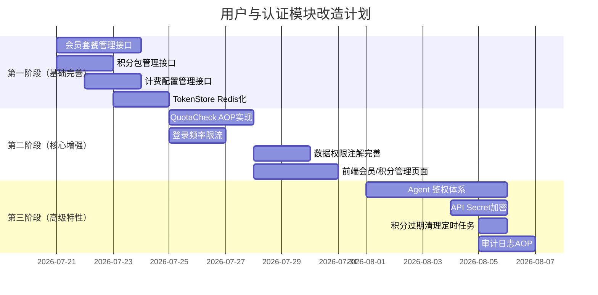

# 用户与认证模块 — 改造设计方案

> **基于架构设计文档(v10.0)、Lenzeto 现有实现与 QuantDinger 可借鉴特性，输出的完整改造方案**

---

## 目录

1. [改造目标](#1-改造目标)
2. [总体架构](#2-总体架构)
3. [认证体系改造](#3-认证体系改造)
4. [授权体系改造](#4-授权体系改造)
5. [会员与计费体系改造](#5-会员与计费体系改造)
6. [前端权限控制改造](#6-前端权限控制改造)
7. [安全管理改造](#7-安全管理改造)
8. [Agent 鉴权改造](#8-agent-鉴权改造)
9. [数据库设计](#9-数据库设计)
10. [API 接口清单](#10-api-接口清单)
11. [实施计划](#11-实施计划)

---

## 1. 改造目标

### 1.1 总体目标

构建一套**完整、安全、可扩展**的用户与认证体系，支撑量化交易系统的多角色协作、商业化和 AI Agent 集成。

### 1.2 具体目标

| 编号 | 目标 | 关联来源 |
|------|------|---------|
| G1 | 完善会员套餐与积分包管理，支持动态配置 | 架构文档 5.1 |
| G2 | 实现 QuotaCheck AOP 切面的自动计费拦截 | 架构文档 5.1.3 |
| G3 | TokenStore 从内存迁移到 Redis，提高持久性 | 现有缺陷 |
| G4 | 完善数据权限注解在各业务 Mapper 上的使用 | 现有扩展 |
| G5 | 添加登录频率限制，提高安全性 | QuantDinger |
| G6 | 实现 Agent 独立鉴权体系，支撑 MCP 工具调用 | QuantDinger |
| G7 | 实现积分过期清理和配额检查定时任务 | 架构文档 |
| G8 | API Secret AES-256-GCM 加密存储 | 架构文档 |

### 1.3 非目标

- OAuth 第三方登录（Google/GitHub）— 按需再开发
- MFA/TOTP 二次验证 — 按需再开发
- Turnstile 人机验证 — 需前端 SDK 配合

---

## 2. 总体架构

### 2.1 改造后的架构图

```text
┌──────────────────────────────────────────────────────────────────────────────┐
│                               接入层 (API Gateway)                          │
│  ┌────────────────────┐  ┌────────────────────┐  ┌────────────────────┐    │
│  │ PC Web (Vue 3)     │  │  H5 (Vue 3)        │  │  Agent (MCP/脚本)  │    │
│  │ Authorization: JWT │  │  Authorization: JWT │  │  Authorization: AK │    │
│  └────────┬───────────┘  └────────┬───────────┘  └────────┬───────────┘    │
│           │                       │                       │                 │
└───────────┼───────────────────────┼───────────────────────┼─────────────────┘
            │                       │                       │
            ▼                       ▼                       ▼
┌──────────────────────────────────────────────────────────────────────────────┐
│                           JwtAuthFilter / AgentAuthFilter                    │
│  ┌────────────────────────────────────────────────────────────────────────┐  │
│  │ • Token 验证 (JWT/AK)  • 黑名单检查 (Redis)  • 权限加载  • 注入 Context│  │
│  └────────────────────────────────────────────────────────────────────────┘  │
└──────────────────────────────────────────────────────────────────────────────┘
            │
            ▼
┌──────────────────────────────────────────────────────────────────────────────┐
│                         SecurityConfig (URL 级权限)                         │
│  ┌────────────────────────────────────────────────────────────────────────┐  │
│  │ 放行: /api/auth/**, /api/agent/**, /api/payment/callback              │  │
│  │ 角色要求: /api/admin/** → ADMIN                                         │  │
│  │ 认证要求: 其余 /api/** → 需认证                                        │  │
│  └────────────────────────────────────────────────────────────────────────┘  │
└──────────────────────────────────────────────────────────────────────────────┘
            │
            ▼
┌──────────────────────────────────────────────────────────────────────────────┐
│                      @PreAuthorize (方法级权限)                             │
│                      + @QuotaCheck (计费切面) [新增]                        │
└──────────────────────────────────────────────────────────────────────────────┘
            │
            ▼
┌──────────────────────────────────────────────────────────────────────────────┐
│                     DataPermissionInterceptor (数据行级权限)                │
│                     + LoginRateLimitAspect (登录限流) [新增]                │
└──────────────────────────────────────────────────────────────────────────────┘
```

### 2.2 模块责任划分

| 模块 | 职责 | 新增/修改 |
|------|------|----------|
| **ai-member** | 认证、授权、会员、计费核心逻辑 | 修改 |
| **ai-common** | TokenStore(Rdis)、SecurityUtils、公共注解 | 修改 |
| **ai-quant** | MyBatisPlusConfig（注册拦截器） | 无需改动 |
| **ai-task** | SecurityConfig（全放行） | 无需改动 |

---

## 3. 认证体系改造

### 3.1 TokenStore Redis 化

**现状**：基于 `ConcurrentHashMap` 的内存黑名单，重启后丢失。

**改造**：

```java
// ai-common: TokenStore 改为 Redis 实现
@Component
public class TokenStore {
    @Autowired
    private RedisCache redisCache;

    private static final String BLACKLIST_PREFIX = "token:blacklist:";
    private static final String ACCESS_PREFIX = "token:access:";
    private static final String REFRESH_PREFIX = "token:refresh:";

    public void storeAccessToken(String token, String userId, long ttlMs) {
        redisCache.set(ACCESS_PREFIX + token, userId, ttlMs / 1000, TimeUnit.SECONDS);
    }

    public void storeRefreshToken(String token, String userId, long ttlMs) {
        redisCache.set(REFRESH_PREFIX + token, userId, ttlMs / 1000, TimeUnit.SECONDS);
    }

    public void blacklistAccessToken(String token) {
        // 将 token 加入黑名单，TTL 设为 Token 剩余有效期
        long ttl = redisCache.getExpire(ACCESS_PREFIX + token);
        if (ttl > 0) {
            redisCache.set(BLACKLIST_PREFIX + token, "1", ttl, TimeUnit.SECONDS);
        }
        redisCache.delete(ACCESS_PREFIX + token);
    }

    public boolean isValidAccessToken(String token) {
        return redisCache.hasKey(ACCESS_PREFIX + token)
            && !redisCache.hasKey(BLACKLIST_PREFIX + token);
    }

    public void storeRefreshToken(String token, String userId, long ttlMs) {
        redisCache.set(REFRESH_PREFIX + token, userId, ttlMs / 1000, TimeUnit.SECONDS);
    }
}
```

### 3.2 登录频率限制

**参考**：QuantDinger 的 `security.check_login_allowed()`

```java
// ai-member: 新增登录限流切面
@Aspect
@Component
public class LoginRateLimitAspect {
    @Autowired
    private RedisCache redisCache;

    private static final String LOGIN_ATTEMPT_PREFIX = "login:attempt:";
    private static final int MAX_ATTEMPTS = 5;      // 最多尝试次数
    private static final int WINDOW_SECONDS = 300;   // 5 分钟窗口
    private static final int BLOCK_MINUTES = 15;     // 封禁分钟

    @Before("execution(* com.chain.ai.trade.member.controller.AuthController.login(..))")
    public void checkLoginRateLimit(JoinPoint jp) {
        // 获取客户端 IP
        HttpServletRequest request = ((ServletRequestAttributes) RequestContextHolder
            .getRequestAttributes()).getRequest();
        String ip = getClientIp(request);

        // 检查是否被封禁
        String blockKey = LOGIN_ATTEMPT_PREFIX + "block:" + ip;
        if (redisCache.hasKey(blockKey)) {
            long remaining = redisCache.getExpire(blockKey);
            throw new LoginBlockedException("登录尝试过多，请 " + (remaining / 60) + " 分钟后重试");
        }

        // 递增尝试次数
        String countKey = LOGIN_ATTEMPT_PREFIX + "count:" + ip;
        long attempts = redisCache.increment(countKey, 1);
        if (attempts == 1) {
            redisCache.expire(countKey, WINDOW_SECONDS, TimeUnit.SECONDS);
        }

        if (attempts > MAX_ATTEMPTS) {
            redisCache.set(blockKey, "1", BLOCK_MINUTES * 60, TimeUnit.SECONDS);
            redisCache.delete(countKey);
            throw new LoginBlockedException("登录尝试过多，已被临时封禁 " + BLOCK_MINUTES + " 分钟");
        }
    }

    private String getClientIp(HttpServletRequest request) {
        String xff = request.getHeader("X-Forwarded-For");
        if (xff != null && !xff.isEmpty()) {
            return xff.split(",")[0].trim();
        }
        return request.getRemoteAddr();
    }
}
```

---

## 4. 授权体系改造

### 4.1 完善数据权限注解

**现状**：仅 `UserRoleRelMapper` 标注了 `@DataScope`。

**改造目标**：以下 Mapper 需要添加 `@DataScope` 注解：

| Mapper | 数据权限字段 | 说明 |
|--------|-------------|------|
| StrategyMapper | `owner_id` | 用户只能看自己的策略 |
| TradingBotMapper | `user_id` | 用户只能看自己的机器人 |
| AiTradeOrderMapper | `user_id` | 用户只能看自己的订单 |
| AnalysisReportMapper | `create_by` | 用户只能看自己的分析报告 |
| FactorMiningTaskMapper | `create_by` | 用户只能看自己的挖掘任务 |

### 4.2 菜单权限增强

**现状**：菜单按权限编码过滤功能已实现。

**改造**：在 MenuServiceImpl 中添加层级控制逻辑，确保父菜单不可见时子菜单自动隐藏。

```java
// MenuServiceImpl getMenuTree() 增加后置过滤
private List<SysMenuVO> filterHiddenMenus(List<SysMenuVO> menus) {
    return menus.stream()
        .filter(m -> isVisible(m, menus))
        .collect(Collectors.toList());
}

private boolean isVisible(SysMenuVO menu, List<SysMenuVO> allMenus) {
    if (menu.getParentId() == null || menu.getParentId() == 0) {
        return true; // 顶级菜单
    }
    // 检查父菜单是否可见
    return allMenus.stream()
        .anyMatch(p -> p.getId().equals(menu.getParentId())
            && !p.isHidden());
}
```

---

## 5. 会员与计费体系改造

### 5.1 会员套餐管理接口

**文件**：`ai-member/controller/admin/MembershipPlanAdminController.java`

| 方法 | 路径 | 说明 |
|------|------|------|
| GET | `/api/admin/membership/plans` | 获取所有会员套餐 |
| POST | `/api/admin/membership/plans` | 新增套餐 |
| PUT | `/api/admin/membership/plans/{id}` | 编辑套餐 |
| DELETE | `/api/admin/membership/plans/{id}` | 删除套餐（软删除） |

```java
@RestController
@RequestMapping("/api/admin/membership/plans")
public class MembershipPlanAdminController {

    @Autowired private MembershipPlanMapper planMapper;

    @GetMapping
    @PreAuthorize("hasAuthority('membership:manage')")
    public Result<List<MembershipPlan>> list() {
        return Result.ok(planMapper.selectList(
            Wrappers.lambdaQuery(MembershipPlan.class).eq(MembershipPlan::getEnabled, true)));
    }

    @PostMapping
    @PreAuthorize("hasAuthority('membership:manage')")
    public Result<Void> create(@Valid @RequestBody MembershipPlan plan) {
        planMapper.insert(plan);
        return Result.ok();
    }

    @PutMapping("/{id}")
    @PreAuthorize("hasAuthority('membership:manage')")
    public Result<Void> update(@PathVariable Long id, @RequestBody MembershipPlan plan) {
        plan.setId(id);
        planMapper.updateById(plan);
        return Result.ok();
    }

    @DeleteMapping("/{id}")
    @PreAuthorize("hasAuthority('membership:manage')")
    public Result<Void> delete(@PathVariable Long id) {
        planMapper.deleteByIdWithFlag(id);
        return Result.ok();
    }
}
```

### 5.2 积分包管理接口

**文件**：`ai-member/controller/admin/CreditPackageAdminController.java`

| 方法 | 路径 | 说明 |
|------|------|------|
| GET | `/api/admin/credit/packages` | 获取积分包列表 |
| POST | `/api/admin/credit/packages` | 新增积分包 |
| PUT | `/api/admin/credit/packages/{id}` | 编辑积分包 |
| DELETE | `/api/admin/credit/packages/{id}` | 删除积分包 |

### 5.3 QuotaCheck AOP 实现

**现状**：`@QuotaCheck` 注解和 `QuotaCheckAspect` 已在架构文档中设计，但未实际实现。

**文件**：`ai-member/aspect/QuotaCheckAspect.java`

```java
@Aspect
@Component
public class QuotaCheckAspect {
    @Autowired private CreditsService creditsService;
    @Autowired private ApiCostConfigMapper costConfigMapper;

    /**
     * 方法执行前检查积分余额
     */
    @Before("@annotation(quotaCheck)")
    public void checkQuota(JoinPoint joinPoint, QuotaCheck quotaCheck) {
        String apiName = quotaCheck.apiName();
        ApiCostConfig config = costConfigMapper.selectByApiName(apiName);
        if (config == null || !config.getEnabled()) {
            return;
        }
        String userId = SecurityUtils.getCurrentUserId();
        int required = config.getCostCredits();
        int balance = creditsService.getBalance(userId);
        if (balance < required) {
            throw new InsufficientCreditsException(
                String.format("调用 %s 需要 %d 积分，当前仅剩 %d 积分", apiName, required, balance));
        }
    }

    /**
     * 方法成功返回后扣减积分
     */
    @AfterReturning("@annotation(quotaCheck)")
    public void deductAfterSuccess(JoinPoint joinPoint, QuotaCheck quotaCheck) {
        String apiName = quotaCheck.apiName();
        ApiCostConfig config = costConfigMapper.selectByApiName(apiName);
        if (config != null && config.getEnabled()) {
            String userId = SecurityUtils.getCurrentUserId();
            creditsService.deductCredits(userId, config.getCostCredits(), "API_COST",
                apiName, "调用接口：" + apiName);
        }
    }
}
```

### 5.4 计费配置管理接口

| 方法 | 路径 | 说明 |
|------|------|------|
| GET | `/api/admin/cost-config` | 获取计费配置列表 |
| PUT | `/api/admin/cost-config` | 更新计费点数 |

### 5.5 积分过期清理定时任务

```java
// ai-task: 每日凌晨执行
@Component
public class CreditsCleanupJobHandler {
    @Autowired private UserMapper userMapper;
    @Autowired private CreditsLogMapper creditsLogMapper;

    /**
     * 清理过期积分
     * 规则：积分有效期 365 天，超过有效期的积分自动扣除
     */
    public void cleanupExpiredCredits() {
        LocalDateTime deadline = LocalDateTime.now().minusDays(365);
        // 查询所有在 deadline 之前的积分增加记录
        List<CreditsLog> expiredLogs = creditsLogMapper.selectList(
            Wrappers.lambdaQuery(CreditsLog.class)
                .lt(CreditsLog::getCreatedAt, deadline)
                .gt(CreditsLog::getChangeAmount, 0)  // 正数=增加
                .eq(CreditsLog::getExpired, false));
        for (CreditsLog log : expiredLogs) {
            creditsService.deductCredits(log.getUserId(), log.getChangeAmount(),
                "EXPIRY", log.getId() + "", "积分过期清理");
            creditsLogMapper.markExpired(log.getId());
        }
    }
}
```

---

## 6. 前端权限控制改造

### 6.1 当前状态

前端已实现完整的**三层权限控制**：
- 路由守卫 (`requiresAuth/requiresAdmin/requiresPermission`)
- 按钮级指令 (`v-permission`)
- 401 自动刷新 Token

### 6.2 改造点

| 改造项 | 说明 | 优先级 |
|--------|------|--------|
| 菜单动态加载 | 根据权限从后端动态获取菜单树（当前仅做前端过滤） | 中 |
| 会员套餐管理页 | 新增会员套餐 CRUD 管理页面 | 高 |
| 积分包管理页 | 新增积分包 CRUD 管理页面 | 高 |
| 计费配置页 | 新增 API 计费配置管理页面 | 中 |
| 用户积分流水页 | 查看积分流水明细 | 中 |

### 6.3 新增路由示例

```typescript
// router/index.ts 新增路由
{
    path: "/system/membership-plans",
    name: "MembershipPlans",
    component: () => import("@/views/system/membership/Plans.vue"),
    meta: {
        title: "会员套餐管理",
        requiresAuth: true,
        requiresPermission: "membership:manage",
    },
},
{
    path: "/system/credit-packages",
    name: "CreditPackages",
    component: () => import("@/views/system/membership/CreditPackages.vue"),
    meta: {
        title: "积分包管理",
        requiresAuth: true,
        requiresPermission: "membership:manage",
    },
},
```

---

## 7. 安全管理改造

### 7.1 API Secret 加密存储

**文件**：`ai-xchange-extends/service/ExchangeAccountService.java`

```java
@Service
public class ExchangeAccountService {
    private static final String AES_KEY_ALIAS = "exchange-aes-key";

    @Autowired private RedisCache redisCache;

    /**
     * AES-256-GCM 加密 API Secret
     */
    public String encryptSecret(String plainSecret) {
        SecretKey key = getOrCreateKey();
        try {
            Cipher cipher = Cipher.getInstance("AES/GCM/NoPadding");
            cipher.init(Cipher.ENCRYPT_MODE, key);
            byte[] iv = cipher.getIV();
            byte[] encrypted = cipher.doFinal(plainSecret.getBytes(StandardCharsets.UTF_8));
            // 存储格式: iv + encrypted (Base64)
            byte[] combined = ByteBuffer.allocate(iv.length + encrypted.length)
                .put(iv).put(encrypted).array();
            return Base64.getEncoder().encodeToString(combined);
        } catch (Exception e) {
            throw new RuntimeException("加密 API Secret 失败", e);
        }
    }

    /**
     * AES-256-GCM 解密 API Secret
     */
    public String decryptSecret(String encryptedSecret) {
        SecretKey key = getOrCreateKey();
        try {
            byte[] decoded = Base64.getDecoder().decode(encryptedSecret);
            ByteBuffer buffer = ByteBuffer.wrap(decoded);
            byte[] iv = new byte[12]; // GCM 标准 IV 12 字节
            buffer.get(iv);
            byte[] encrypted = new byte[buffer.remaining()];
            buffer.get(encrypted);
            Cipher cipher = Cipher.getInstance("AES/GCM/NoPadding");
            cipher.init(Cipher.DECRYPT_MODE, key, new GCMParameterSpec(128, iv));
            return new String(cipher.doFinal(encrypted), StandardCharsets.UTF_8);
        } catch (Exception e) {
            throw new RuntimeException("解密 API Secret 失败", e);
        }
    }

    private SecretKey getOrCreateKey() {
        // 从 Redis 获取密钥，如不存在则生成并存储
        String keyStr = redisCache.get(AES_KEY_ALIAS);
        if (keyStr == null) {
            KeyGenerator kg = KeyGenerator.getInstance("AES");
            kg.init(256);
            SecretKey key = kg.generateKey();
            redisCache.set(AES_KEY_ALIAS, Base64.getEncoder().encodeToString(key.getEncoded()));
            return key;
        }
        byte[] decoded = Base64.getDecoder().decode(keyStr);
        return new SecretKeySpec(decoded, "AES");
    }
}
```

### 7.2 审计日志 AOP

```java
// ai-member/aspect/AuditLogAspect.java
@Aspect
@Component
public class AuditLogAspect {

    @Autowired private AuditLogMapper auditLogMapper;

    @Pointcut("@annotation(com.chain.ai.trade.member.annotation.AuditLog)")
    public void auditPointcut() {}

    @Around("auditPointcut() && @annotation(auditLog)")
    public Object logAudit(ProceedingJoinPoint pjp, AuditLog auditLog) throws Throwable {
        long startTime = System.currentTimeMillis();
        String userId = SecurityUtils.getCurrentUserId();
        String method = pjp.getSignature().toShortString();
        String args = Arrays.toString(pjp.getArgs());

        try {
            Object result = pjp.proceed();
            long duration = System.currentTimeMillis() - startTime;

            auditLogMapper.insert(new AuditLog()
                .setUserId(userId)
                .setAction(auditLog.action())
                .setModule(auditLog.module())
                .setMethod(method)
                .setParams(truncateArgs(args))
                .setResult("SUCCESS")
                .setDuration(duration)
                .setCreateTime(LocalDateTime.now()));
            return result;
        } catch (Exception e) {
            long duration = System.currentTimeMillis() - startTime;
            auditLogMapper.insert(new AuditLog()
                .setUserId(userId)
                .setAction(auditLog.action())
                .setModule(auditLog.module())
                .setMethod(method)
                .setParams(truncateArgs(args))
                .setResult("FAILED:" + e.getMessage())
                .setDuration(duration)
                .setCreateTime(LocalDateTime.now()));
            throw e;
        }
    }
}
```

---

## 8. Agent 鉴权改造

### 8.1 设计目标

参考 QuantDinger 的 `agent_auth.py`，为 MCP 工具 / 自动化脚本提供独立鉴权。

### 8.2 数据表

```sql
-- agent_token 表
CREATE TABLE `agent_token` (
    `id` bigint PRIMARY KEY AUTO_INCREMENT,
    `token_id` varchar(64) NOT NULL UNIQUE COMMENT 'Token ID',
    `token_value` varchar(255) NOT NULL COMMENT 'Token 值（加密存储）',
    `user_id` varchar(32) NOT NULL COMMENT '所属用户',
    `name` varchar(100) COMMENT 'Token 名称/用途',
    `scopes` varchar(200) NOT NULL COMMENT '能力范围（逗号分隔）：R=读,W=写,B=回测,N=通知,C=凭证,T=交易',
    `rate_limit` int DEFAULT 100 COMMENT '每分钟最大请求数',
    `enabled` tinyint(1) DEFAULT 1,
    `last_used_at` datetime COMMENT '最后使用时间',
    `expires_at` datetime COMMENT '过期时间（NULL=永不过期）',
    `created_at` datetime DEFAULT CURRENT_TIMESTAMP,
    `create_by` varchar(64),
    `delete_flag` tinyint(1) DEFAULT 0,
    PRIMARY KEY (`id`),
    KEY `idx_user_id` (`user_id`),
    KEY `idx_token_id` (`token_id`)
) ENGINE=InnoDB DEFAULT CHARSET=utf8mb4 COMMENT='Agent API Token 表';
```

### 8.3 AgentAuthFilter

```java
// ai-member/config/agent/AgentAuthFilter.java
@Component
public class AgentAuthFilter extends OncePerRequestFilter {

    @Autowired private AgentTokenService agentTokenService;
    @Autowired private RedisCache redisCache;

    private static final String AGENT_TOKEN_PREFIX = "qd_agent_";

    @Override
    protected boolean shouldNotFilter(HttpServletRequest request) {
        String path = request.getRequestURI();
        return !path.startsWith("/api/agent/");
    }

    @Override
    protected void doFilterInternal(HttpServletRequest request,
                                     HttpServletResponse response,
                                     FilterChain chain) throws ServletException, IOException {
        String authHeader = request.getHeader("Authorization");
        if (authHeader == null || !authHeader.startsWith("Bearer ")) {
            chain.doFilter(request, response);
            return;
        }

        String token = authHeader.substring(7);
        if (!token.startsWith(AGENT_TOKEN_PREFIX)) {
            chain.doFilter(request, response);  // 非 Agent Token，交给 JwtAuthFilter
            return;
        }

        // 验证 Agent Token
        AgentToken agentToken = agentTokenService.validateToken(token);
        if (agentToken == null) {
            response.setStatus(401);
            response.getWriter().write("{\"code\":401,\"msg\":\"Agent Token invalid or expired\"}");
            return;
        }

        // 检查速率限制
        if (!checkRateLimit(agentToken)) {
            response.setStatus(429);
            response.getWriter().write("{\"code\":429,\"msg\":\"Rate limit exceeded\"}");
            return;
        }

        // 构建认证信息
        UsernamePasswordAuthenticationToken auth = new UsernamePasswordAuthenticationToken(
            agentToken.getUserId(), null,
            List.of(new SimpleGrantedAuthority("ROLE_AGENT"))
        );
        auth.setDetails(agentToken);
        SecurityContextHolder.getContext().setAuthentication(auth);

        // 更新最后使用时间
        agentTokenService.updateLastUsed(agentToken.getTokenId());

        chain.doFilter(request, response);
    }

    private boolean checkRateLimit(AgentToken token) {
        String key = "agent:ratelimit:" + token.getTokenId();
        Long count = redisCache.increment(key, 1);
        if (count == 1) {
            redisCache.expire(key, 60, TimeUnit.SECONDS);
        }
        return count <= token.getRateLimit();
    }
}
```

### 8.4 Agent Token 管理 API

| 方法 | 路径 | 说明 |
|------|------|------|
| GET | `/api/agent/tokens` | 获取当前用户的 Agent Token 列表 |
| POST | `/api/agent/tokens` | 创建 Agent Token |
| DELETE | `/api/agent/tokens/{tokenId}` | 吊销 Agent Token |
| PUT | `/api/agent/tokens/{tokenId}/toggle` | 启用/禁用 Token |

---

## 9. 数据库设计

### 9.1 现有表状态

| 表名 | 状态 | 说明 |
|------|------|------|
| user | ✅ 已存在 | 含 credits_balance, membership_level, membership_expire_time |
| role | ✅ 已存在 | 预置 ADMIN/PREMIUM/BASIC |
| permission | ✅ 已存在 | 26个权限点 |
| user_role_rel | ✅ 已存在 | 用户-角色关联 |
| role_permission | ✅ 已存在 | 角色-权限关联 |
| sys_menu | ✅ 已存在 | 菜单权限配置 |
| payment_transaction | ✅ 已存在 | 支付订单表 |
| credits_log | ✅ 已存在 | 积分流水表 |
| api_cost_config | ✅ 已存在 | 计费配置表 |

### 9.2 新增表

| 表名 | 说明 | 是否必需 |
|------|------|---------|
| membership_plan | 会员套餐定义 | 高 |
| credit_package | 积分包定义 | 高 |
| membership_benefit | 会员权益配置 | 中 |
| agent_token | Agent API Token | 高 |
| audit_logs | 审计日志 | 中 |

### 9.3 全部建表 SQL

```sql
-- ============================================================
-- 1. 会员套餐定义表
-- ============================================================
CREATE TABLE IF NOT EXISTS `membership_plan` (
  `id` bigint PRIMARY KEY AUTO_INCREMENT,
  `name` varchar(50) NOT NULL COMMENT '套餐名称',
  `level` varchar(20) NOT NULL COMMENT '会员等级：BASIC/PREMIUM/PRO',
  `duration_days` int NOT NULL COMMENT '有效天数（30/365）',
  `price_usd` decimal(10,2) NOT NULL COMMENT '价格(USD)',
  `monthly_credits` int NOT NULL DEFAULT 0 COMMENT '每月赠送积分',
  `description` text COMMENT '套餐描述',
  `sort_order` int DEFAULT 0 COMMENT '排序',
  `enabled` tinyint(1) DEFAULT 1 COMMENT '是否启用',
  `create_time` datetime DEFAULT CURRENT_TIMESTAMP,
  `update_time` datetime DEFAULT CURRENT_TIMESTAMP ON UPDATE CURRENT_TIMESTAMP,
  `delete_flag` tinyint(1) DEFAULT 0,
  PRIMARY KEY (`id`)
) ENGINE=InnoDB DEFAULT CHARSET=utf8mb4 COMMENT='会员套餐定义表';

-- ============================================================
-- 2. 积分包定义表
-- ============================================================
CREATE TABLE IF NOT EXISTS `credit_package` (
  `id` bigint PRIMARY KEY AUTO_INCREMENT,
  `name` varchar(50) NOT NULL COMMENT '积分包名称',
  `credits` int NOT NULL COMMENT '积分数量',
  `price_usd` decimal(10,2) NOT NULL COMMENT '价格(USD)',
  `bonus_credits` int DEFAULT 0 COMMENT '赠送积分',
  `sort_order` int DEFAULT 0,
  `enabled` tinyint(1) DEFAULT 1,
  `create_time` datetime DEFAULT CURRENT_TIMESTAMP,
  `update_time` datetime DEFAULT CURRENT_TIMESTAMP ON UPDATE CURRENT_TIMESTAMP,
  `delete_flag` tinyint(1) DEFAULT 0,
  PRIMARY KEY (`id`)
) ENGINE=InnoDB DEFAULT CHARSET=utf8mb4 COMMENT='积分包定义表';

-- ============================================================
-- 3. 会员权益配置表
-- ============================================================
CREATE TABLE IF NOT EXISTS `membership_benefit` (
  `id` bigint PRIMARY KEY AUTO_INCREMENT,
  `level` varchar(20) NOT NULL COMMENT '会员等级',
  `max_bots` int DEFAULT 5 COMMENT '最大机器人数量',
  `max_backtests_per_day` int DEFAULT 10 COMMENT '每日回测次数',
  `max_ai_analysis_per_day` int DEFAULT 20 COMMENT '每日AI分析次数',
  `allow_custom_factor` tinyint(1) DEFAULT 0 COMMENT '是否允许自定义因子',
  `allow_ml_training` tinyint(1) DEFAULT 0 COMMENT '是否允许ML训练',
  `description` text,
  `create_time` datetime DEFAULT CURRENT_TIMESTAMP,
  `update_time` datetime DEFAULT CURRENT_TIMESTAMP ON UPDATE CURRENT_TIMESTAMP,
  PRIMARY KEY (`id`),
  UNIQUE KEY `uk_level` (`level`)
) ENGINE=InnoDB DEFAULT CHARSET=utf8mb4 COMMENT='会员权益配置表';

-- ============================================================
-- 4. Agent API Token 表
-- ============================================================
CREATE TABLE IF NOT EXISTS `agent_token` (
  `id` bigint PRIMARY KEY AUTO_INCREMENT,
  `token_id` varchar(64) NOT NULL UNIQUE COMMENT 'Token ID',
  `token_hash` varchar(255) NOT NULL COMMENT 'Token 哈希值（SHA-256）',
  `token_prefix` varchar(20) NOT NULL COMMENT 'Token 前缀（用于显示辨识）',
  `user_id` varchar(32) NOT NULL COMMENT '所属用户',
  `name` varchar(100) COMMENT 'Token 名称',
  `scopes` varchar(200) NOT NULL DEFAULT 'R' COMMENT '能力范围：R,W,B,N,C,T',
  `rate_limit` int DEFAULT 100 COMMENT '每分钟最大请求数',
  `enabled` tinyint(1) DEFAULT 1,
  `last_used_at` datetime COMMENT '最后使用时间',
  `expires_at` datetime COMMENT '过期时间',
  `create_time` datetime DEFAULT CURRENT_TIMESTAMP,
  `create_by` varchar(64),
  `delete_flag` tinyint(1) DEFAULT 0,
  PRIMARY KEY (`id`),
  KEY `idx_user_id` (`user_id`),
  KEY `idx_token_id` (`token_id`)
) ENGINE=InnoDB DEFAULT CHARSET=utf8mb4 COMMENT='Agent API Token 表';

-- ============================================================
-- 5. 审计日志表
-- ============================================================
CREATE TABLE IF NOT EXISTS `audit_logs` (
  `id` bigint PRIMARY KEY AUTO_INCREMENT,
  `user_id` varchar(32) COMMENT '操作用户',
  `action` varchar(100) NOT NULL COMMENT '操作标识',
  `module` varchar(50) COMMENT '所属模块',
  `method` varchar(200) COMMENT '调用方法',
  `params` text COMMENT '请求参数',
  `result` varchar(20) COMMENT '结果：SUCCESS/FAILED',
  `error_msg` text COMMENT '错误信息',
  `duration` int COMMENT '执行耗时(ms)',
  `ip` varchar(50) COMMENT '客户端IP',
  `user_agent` varchar(500) COMMENT 'User-Agent',
  `create_time` datetime DEFAULT CURRENT_TIMESTAMP,
  PRIMARY KEY (`id`),
  KEY `idx_user_id` (`user_id`),
  KEY `idx_action` (`action`),
  KEY `idx_create_time` (`create_time`)
) ENGINE=InnoDB DEFAULT CHARSET=utf8mb4 COMMENT='审计日志表';

-- ============================================================
-- 6. 初始化数据
-- ============================================================

-- 默认会员套餐
INSERT INTO `membership_plan` (`name`, `level`, `duration_days`, `price_usd`, `monthly_credits`, `description`, `sort_order`) VALUES
('基础版', 'BASIC', 0, 0.00, 0, '免费基础功能', 0),
('高级月度', 'PREMIUM', 30, 29.99, 500, '高级功能月度订阅', 1),
('高级年度', 'PREMIUM', 365, 299.99, 500, '高级功能年度订阅（省2个月）', 2),
('专业月度', 'PRO', 30, 99.99, 2000, '全部功能月度订阅', 3),
('专业年度', 'PRO', 365, 999.99, 2000, '全部功能年度订阅（省2个月）', 4);

-- 默认会员权益
INSERT INTO `membership_benefit` (`level`, `max_bots`, `max_backtests_per_day`, `max_ai_analysis_per_day`, `allow_custom_factor`, `allow_ml_training`) VALUES
('BASIC', 2, 3, 5, 0, 0),
('PREMIUM', 10, 20, 50, 1, 1),
('PRO', 99, 100, 200, 1, 1);

-- 默认积分包
INSERT INTO `credit_package` (`name`, `credits`, `price_usd`, `bonus_credits`, `sort_order`) VALUES
('小包', 100, 4.99, 0, 1),
('中包', 500, 19.99, 50, 2),
('大包', 2000, 69.99, 300, 3),
('超大包', 5000, 149.99, 1000, 4);
```

---

## 10. API 接口清单

### 10.1 认证相关（现有 + 新增）

| 方法 | 路径 | 说明 | 状态 |
|------|------|------|------|
| POST | `/api/auth/login` | 密码登录 | 现有 |
| POST | `/api/auth/register` | 注册 | 现有 |
| POST | `/api/auth/send-email-code` | 发送邮箱验证码 | 现有 |
| POST | `/api/auth/login-by-email` | 邮箱验证码登录 | 现有 |
| GET | `/api/auth/me` | 获取当前用户 | 现有 |
| POST | `/api/auth/refresh` | 刷新 Token | 现有 |
| POST | `/api/auth/logout` | 登出 | 现有 |
| POST | `/api/auth/password` | 修改密码 | 现有 |

### 10.2 用户管理（现有）

| 方法 | 路径 | 说明 | 状态 |
|------|------|------|------|
| GET | `/api/users/profile` | 个人资料 | 现有 |
| GET | `/api/users` | 用户列表 | 现有 |
| POST | `/api/users` | 创建用户 | 现有 |
| PUT | `/api/users/{userId}` | 更新用户 | 现有 |
| DELETE | `/api/users/{userId}` | 删除用户 | 现有 |
| PUT | `/api/users/{userId}/status` | 切换状态 | 现有 |

### 10.3 权限管理（现有）

| 方法 | 路径 | 说明 | 状态 |
|------|------|------|------|
| GET | `/api/admin/permissions` | 权限列表 | 现有 |
| GET | `/api/admin/roles` | 角色列表 | 现有 |
| POST | `/api/admin/roles` | 创建角色 | 现有 |
| PUT | `/api/admin/roles/{id}` | 编辑角色 | 现有 |
| DELETE | `/api/admin/roles/{id}` | 删除角色 | 现有 |
| GET | `/api/admin/roles/{roleId}/permissions` | 角色权限 | 现有 |
| PUT | `/api/admin/roles/{roleId}/permissions` | 分配权限 | 现有 |
| GET | `/api/admin/users/{userId}/roles` | 用户角色 | 现有 |
| PUT | `/api/admin/users/{userId}/roles` | 分配角色 | 现有 |

### 10.4 会员管理（新增）

| 方法 | 路径 | 说明 | 状态 |
|------|------|------|------|
| GET | `/api/admin/membership/plans` | 套餐列表 | 新增 |
| POST | `/api/admin/membership/plans` | 新增套餐 | 新增 |
| PUT | `/api/admin/membership/plans/{id}` | 编辑套餐 | 新增 |
| DELETE | `/api/admin/membership/plans/{id}` | 删除套餐 | 新增 |
| GET | `/api/admin/credit/packages` | 积分包列表 | 新增 |
| POST | `/api/admin/credit/packages` | 新增积分包 | 新增 |
| PUT | `/api/admin/credit/packages/{id}` | 编辑积分包 | 新增 |
| DELETE | `/api/admin/credit/packages/{id}` | 删除积分包 | 新增 |
| GET | `/api/admin/cost-config` | 计费配置列表 | 新增 |
| PUT | `/api/admin/cost-config` | 更新计费配置 | 新增 |

### 10.5 Agent Token 管理（新增）

| 方法 | 路径 | 说明 | 状态 |
|------|------|------|------|
| GET | `/api/agent/tokens` | Token 列表 | 新增 |
| POST | `/api/agent/tokens` | 创建 Token | 新增 |
| DELETE | `/api/agent/tokens/{tokenId}` | 吊销 Token | 新增 |
| PUT | `/api/agent/tokens/{tokenId}/toggle` | 启用/禁用 | 新增 |

---

## 11. 实施计划

### 11.1 实施路线图



### 11.2 阶段一：基础完善（约 5 天）

| 任务 | 工作量 | 输出 | 优先级 |
|------|--------|------|--------|
| 会员套餐 CRUD 接口 | 2人天 | MembershipPlanAdminController | P0 |
| 积分包 CRUD 接口 | 1人天 | CreditPackageAdminController | P0 |
| 计费配置管理接口 | 1人天 | CostConfigController | P1 |
| TokenStore Redis 化 | 1人天 | TokenStore 重构 | P1 |

### 11.3 阶段二：核心增强（约 5 天）

| 任务 | 工作量 | 输出 | 优先级 |
|------|--------|------|--------|
| QuotaCheck AOP | 2人天 | QuotaCheckAspect + 注解完善 | P0 |
| 登录频率限制 | 1人天 | LoginRateLimitAspect | P1 |
| 数据权限注解完善 | 1人天 | 各 Mapper @DataScope | P1 |
| 前端管理页面 | 2人天 | 会员套餐/积分包/计费配置页 | P0 |

### 11.4 阶段三：高级特性（约 7 天）

| 任务 | 工作量 | 输出 | 优先级 |
|------|--------|------|--------|
| Agent 鉴权体系 | 3人天 | AgentTokenService + AgentAuthFilter + Token管理API | P1 |
| API Secret 加密 | 1人天 | ExchangeAccountService 加密工具 | P2 |
| 积分过期清理 | 0.5人天 | CreditsCleanupJobHandler | P2 |
| 审计日志 AOP | 1.5人天 | AuditLogAspect + audit_logs 表 | P2 |

### 11.5 总计工作量

| 阶段 | 人天 | 影响模块 |
|------|------|---------|
| 阶段一 | 5 | ai-member + ai-common |
| 阶段二 | 6 | ai-member + ai-frontend-web |
| 阶段三 | 6 | ai-member + ai-xchange-extends + ai-task |
| **合计** | **17** | |

---

*文档结束*
