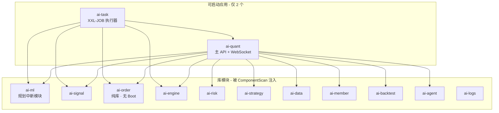
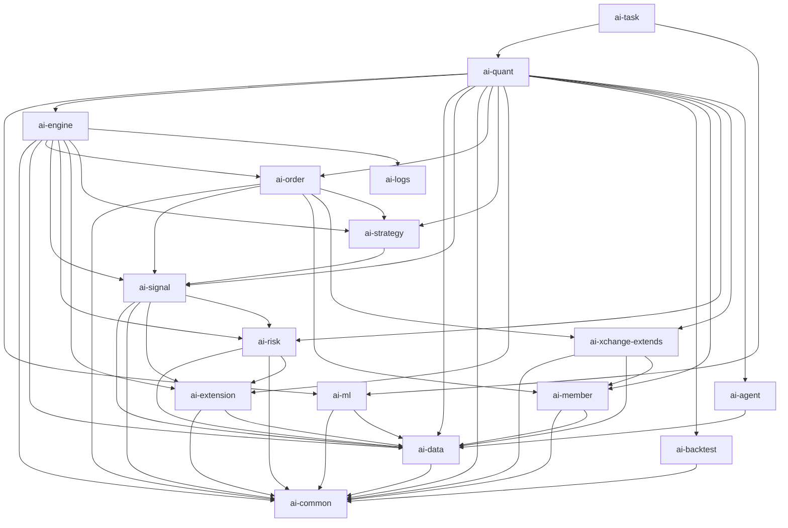

# Lenzito 后端重构文档与计划

> **范围**：`lenzito-parent` 下 16+ 个 Maven 模块（含规划中的 **ai-ml**），约 **812** 个 `src/main/java` 文件  
> **约束**：按阶段推进，每步编译/回归通过后再进入下一步  
> **关联文档**：[执行清单](./执行清单.md) · [既有分步计划](../REFACTORING_PLAN.md)  
> **版本**：v1.1 · 2026-05-30  
> **架构约定**：可启动应用仅 **ai-quant**、**ai-task**；**ai-order** 为纯库模块，**不**提供独立 Boot 入口

---

## 目录

- [一、执行摘要](#一执行摘要)
- [二、现状架构](#二现状架构)
- [三、包结构与边界问题](#三包结构与边界问题)
- [四、代码质量评估](#四代码质量评估)
- [五、目标架构](#五目标架构建议)
- [5.4 ai-ml 模块规划](#54-ai-ml-模块规划新增)
- [5.5 可启动应用约定](#55-可启动应用约定)
- [六、分阶段重构计划](#六重构计划分阶段)
- [七、风险与缓解](#七风险与缓解)
- [八、成功指标](#八成功指标可量化)
- [九、Roadmap 总览](#九优先级总览-roadmap)
- [十、即时行动清单](#十建议的即时行动清单)

---

## 一、执行摘要

当前后端是 **「多 Maven 模块 + 单/双 Boot 聚合运行时」** 的模块化单体（Modular Monolith）：`ai-quant` 通过 `@ComponentScan` 拉起几乎全部业务，`ai-task` 再依赖 `ai-quant` 跑 XXL-JOB。模块划分在概念上清晰（信号、订单、风控、策略等），但 **包名与 artifact 不对齐、库模块内嵌 Controller、模块间网状依赖、巨型类集中、测试极薄**，使「按域独立演进」成本高。

重构目标不是立刻微服务化，而是：**先理顺边界与依赖方向，再拆分 God Class，最后才考虑独立部署**。

| 维度 | 现状评级 | 核心问题 |
|------|----------|----------|
| 架构 | ⚠️ 中等 | 运行时 monolith，设计文档与实现脱节 |
| 模块设计 | ⚠️ 中等 | 16 模块名与职责部分重叠，存在空模块与 `bin/` 镜像 |
| 包结构 | ❌ 偏弱 | `engine.*` 与 artifact 混用，ComponentScan 有误 |
| 代码质量 | ❌ 偏弱 | 18 个 >800 行类，JSON 库混用，主 API 零单测 |

---

## 二、现状架构

### 2.1 技术栈（实际）

| 项 | 版本/选型 |
|----|-----------|
| Java | 父 POM `release=25`，编译插件 `source/target=21`（**不一致**） |
| Spring Boot | **4.0.1** |
| 持久化 | MyBatis-Plus（**3.5.7 / 3.5.15 混用**）、MySQL、Redis/Redisson |
| 交易/指标 | Ta4j 0.22.6、自研 `ai-extension` |
| 交易所 | XChange 5.2.3 + `ai-xchange-extends`（OKX 自实现） |
| 调度 | XXL-JOB 2.4.1（`ai-quant` + `ai-task` 均有 handler） |
| AI | LangChain4j、Spring AI MCP、`ai-agent` |

### 2.2 运行时拓扑



**结论**：

- **可启动应用仅 `ai-quant`（主 API）与 `ai-task`（调度）**；与 `完整架构设计文档` 12.1 节一致。
- **`ai-order` 不做启动应用**：仅保留 `com.chain.ai.trade.order` 领域服务与 Mapper；`AiOrderApplication` 为历史遗留，应在阶段 0/1 **删除或改为测试用 `@SpringBootTest` 配置**，不得出现在生产部署与 README 多端口说明中。
- **`ai-ml` 尚未建 Maven 模块**，机器学习与因子挖掘代码现散落在 `ai-quant`（约 33 个 Java 文件 + `FactorMiningJobHandler` 等），重构阶段 1 需抽出为独立库模块。
- `ai-task → ai-quant` 使任务进程携带完整 Web 依赖，违反「瘦任务节点」原则；抽出 `ai-ml` 后，ML 相关 Job 应只依赖 `ai-ml` + `ai-data`，而非整个 `ai-quant`。

### 2.3 模块职责与规模

| 模块 | Java 文件数 | 角色 | 包根（主要） |
|------|------------|------|-------------|
| **ai-quant** | ~233 | API、WS、ML、通知、部分 job | `com.chain.ai.trade.engine.*` |
| **ai-signal** | ~92 | 信号生成、规则引擎 | `com.chain.ai.trade.engine.signal` |
| **ai-risk** | ~83 | 风控评估、日内状态机 | `com.chain.ai.trade.engine.risk` |
| **ai-member** | ~74 | 用户/RBAC/支付 | `com.chain.ai.trade.member` ✅ |
| **ai-strategy** | ~52 | 策略/机器人 | `com.chain.ai.trade.engine.strategy` |
| **ai-order** | ~45 | 订单生命周期 | `com.chain.ai.trade.order` ✅ |
| **ai-logs** | ~41 | 日志查询/WS | `com.chain.ai.trade.logs` ✅ |
| **ai-extension** | ~37 | Ta4j 扩展规则/指标 | `com.chain.ai.trade.extension` ✅ |
| **ai-common** | ~29 | 工具、DTO | `com.chain.ai.trade.common` ✅ |
| **ai-data** | ~25 | K 线、优化任务 | `com.chain.ai.trade.engine.data` |
| **ai-backtest** | ~25 | 回测任务/结果 | `com.chain.ai.trade.backtest` ✅ |
| **ai-xchange-extends** | ~27 | OKX/Huobi 封装 | `com.chain.ai.trade.engine.xchange` |
| **ai-engine** | ~23 | 回测引擎、策略执行枢纽 | `com.chain.ai.trade.engine` |
| **ai-task** | ~14 | 定时任务入口 | `task` + `engine.task` 双根 |
| **ai-agent** | ~12 | Agent/MCP | `com.chain.ai.trade.agent` ✅ |
| **ai-ml** | **0（规划）** | ML 训练/推理、因子挖掘、自动搜参 | `com.chain.ai.trade.ml`（目标） |
| **ai-account** | **0** | 空占位 | — |

**ai-ml 现状（代码在 ai-quant）**：

| 迁入 ai-ml 的代码（示例） | 当前路径 |
|--------------------------|----------|
| 因子遗传规划 | `engine.service.ml.factor.*` |
| 训练/推理 | `MLTrainingService`, `MLInferenceService`, `*ModelTrainer` |
| 自动搜参 | `AutoSearchService`, `AutoSearchController` |
| 因子 API | `FactorMiningController`, `FactorMiningTaskService` |
| 模型 API | `MlModelController` |
| 配置 | `MlProperties`, `quant.ml.*` |
| 定时任务 | `FactorMiningJobHandler`, `MLTrainingJobHandler`（若在 quant/task） |
| 持久化 | `FactorMiningTaskMapper`, `AutoSearchResultMapper` 等 |

### 2.4 依赖关系（重构关键）

```text
ai-common
    ↑
ai-data → ai-extension
    ↑
ai-risk ← ai-signal → ai-strategy
    ↑         ↑
    └──── ai-order ← ai-xchange-extends, ai-member
              ↑
         ai-engine（再依赖 order/signal/strategy/risk/logs）
              ↑
         ai-ml（规划：依赖 data + common + smile，**不**依赖 order/engine）
              ↑
         ai-quant（聚合 API；依赖 ai-ml，逐步去掉内嵌 ml 包）
              ↑
         ai-task（依赖 ai-quant ⚠️ → 目标：依赖 ai-ml + 各域库，不依赖 quant）
```

**问题链**：`order → signal → risk`，`engine → order + signal + strategy`，形成 **业务环**；ML 与交易环纠缠在 `ai-quant` 单模块内，阻碍独立测试与扩容。

### 2.5 与设计文档的偏差

`docs/设计文档/完整架构设计文档.md`（v10.0）写明：

- 技术栈写 **Spring Boot 3.2+ / Java 25**，实现为 **Boot 4.0.1**，编译目标仍有 21。
- 回测、实盘标为「待实现」，代码中已有 `BacktestEngine`、`TradeOrderServiceImpl`、`BacktestController` 等大量实现。

**建议**：重构前先做一次 **「文档 ↔ 代码」对齐清单**，避免按过期设计拆模块。

---

## 三、包结构与边界问题

### 3.1 模块名 vs 包名

| artifactId | 期望包 | 实际包 | 对齐 |
|------------|--------|--------|------|
| ai-order | `trade.order` | `trade.order` | ✅ |
| ai-member | `trade.member` | `trade.member` | ✅ |
| ai-backtest | `trade.backtest` | `trade.backtest` | ✅ |
| ai-data | `trade.data` | `trade.engine.data` | ❌ |
| ai-signal | `trade.signal` | `trade.engine.signal` | ❌ |
| ai-risk | `trade.risk` | `trade.engine.risk` | ❌ |
| ai-strategy | `trade.strategy` | `trade.engine.strategy` | ❌ |

### 3.2 ComponentScan 错误包

`AiQuantApplication` 扫描了不存在的包 `com.chain.ai.trade.signal`、`com.chain.ai.trade.data`；实际代码在 `engine.signal`、`engine.data`。目前靠 `com.chain.ai.trade.engine` 兜底仍能启动。

### 3.3 HTTP 层泄漏到库模块

| 模块 | Controller 数量 | 示例 |
|------|-----------------|------|
| ai-quant | ~50 | `KLineV1Controller`, `BacktestController` |
| ai-member | 6 | `AuthController`, `PaymentController` |
| ai-signal | 1 | `TechnicalSignalController` |
| ai-logs | 1 | `LogQueryController` |
| ai-agent | 1 | `AgentController` |

**原则**：库模块应只暴露 Service 接口 + SPI；REST 应集中在 api 层（当前即 `ai-quant`）。

### 3.4 工程卫生

- **11 个模块存在 `bin/` 目录**（Eclipse 输出镜像）
- **`ai-quant/pom.xml` 重复声明 `ai-engine` 两次**
- **`ai-account` 空模块**
- **遗留文件**：如 `ai-quant/.tmp_bak_SSC.java`

---

## 四、代码质量评估

### 4.1 巨型类（>800 行，共 18 个）

| 行数 | 类 | 模块 |
|------|-----|------|
| ~3574 | `ElliottWaveEvaluator` | ai-risk |
| ~3144 | `DefaultDealStrategyTrade` | ai-engine |
| ~2980 | `TradeOrderServiceImpl` | ai-order |
| ~2124 | `MacdSignService` | ai-signal |
| ~1906 | `BacktestController` | ai-quant |
| ~1667 | `BacktestEngine` | ai-engine |
| ~1607 | `LiveAdviceController` | ai-quant |
| ~1497 | `BacktestService` | ai-engine |
| ~1452 | `StrategyManageController` | ai-quant |
| ~1427 | `DefaultSignService` | ai-signal |
| ~1191 | `KLineV1ServiceImpl` | ai-quant |
| ~1109 | `BollingerRsiSignService` | ai-signal |
| ~1077 | `OkxExchangeService` | ai-xchange-extends |
| ~1046 | `PriceTrendChannelSignService` | ai-signal |
| ~1008 | `SmartMoneyConceptsIndicator` | ai-extension |
| ~861 | `SmartWeightAdjuster` | ai-risk |
| ~857 | `TradingAccountController` | ai-quant |

### 4.2 横切关注点

| 项 | 现状 | 建议方向 |
|----|------|----------|
| JSON | fastjson + Jackson + `org.json` 混用 | 统一 Jackson |
| 事务 | `@Transactional` 稀疏 | 应用服务层明确边界 |
| 异常 | `GlobalExceptionHandler` 仅在 ai-quant | 抽到 common-web 或 api 模块 |
| API 文档 | ai-signal 仍依赖 springfox 3.0 | 迁移 springdoc-openapi |
| 测试 | ~14 个 Test / ~812 源文件 ≈ **1.7%** | 核心路径 ≥40%（阶段 2 末） |

### 4.3 重复与越界

- `FeatureVector` 等在 ai-signal 与 ai-quant 重复
- `OkxExchangeKlineFetcher` 与 ai-data provider 并行
- JobHandler 在 ai-quant 与 ai-task 重复
- 风控适配器部分在 ai-quant，部分在 ai-risk

### 4.4 积极面（应保留）

- 领域模块划分有雏形
- `ai-extension` 对 Ta4j 扩展相对独立
- `ISignService`、`ITradeOrderService` 等可作为 Port 重构起点

---

## 五、目标架构（建议）

### 5.1 分层模型（单体内）

```text
┌─────────────────────────────────────────────────────────┐
│  ai-api (或由 ai-quant 演进)                             │
│  Controller / DTO / WebSocket / 全局异常 / 安全配置        │
└───────────────────────────┬─────────────────────────────┘
                            │ 仅依赖 Application 接口
┌───────────────────────────▼─────────────────────────────┐
│  应用层（用例编排）                                        │
│  GenerateSignal, PlaceOrder, RunBacktest                   │
└───────────────────────────┬─────────────────────────────┘
                            │
┌───────────────────────────▼─────────────────────────────┐
│  领域模块（无 Spring Web）                                 │
│  signal │ order │ risk │ strategy │ backtest │ member │ ml │
└───────────────────────────┬─────────────────────────────┘
                            │
┌───────────────────────────▼─────────────────────────────┐
│  infrastructure：data / xchange / extension / persistence │
└─────────────────────────────────────────────────────────┘
         ai-common
```

### 5.2 目标依赖（有向无环）

```text
ai-ml → ai-common, ai-data, smile（禁止依赖 ai-order, ai-engine, ai-quant）
ai-order → 纯库；无 spring-boot-maven-plugin，无 main 启动类
ai-engine → 仅依赖 *-api + data + extension（不直接依赖 order-impl）
ai-task → ai-ml + 各域库 + scheduler（禁止依赖 ai-quant）
ai-quant → ai-ml + 各域库 + HTTP/WS（ML Controller 可暂留 quant，委托 ai-ml 服务）
```

### 5.3 包命名目标（长期）

`com.chain.ai.trade.<domain>.<layer>`，与 artifactId 一一对应。

### 5.4 ai-ml 模块规划（新增）

与 `docs/设计文档/完整架构设计文档.md` §12.1 对齐，**新建 Maven 模块 `ai-ml`**（当前仓库尚无该目录）。

#### 模块定位

| 项 | 说明 |
|----|------|
| **类型** | 库模块（`packaging: jar`），**不可**独立 `SpringApplication.run` |
| **职责** | 特征工程、模型训练/推理、因子遗传规划、自动搜参、模型与因子任务持久化 |
| **不负责** | HTTP 路由（由 ai-quant 薄 Controller 委托）、实盘下单、信号生成 |

#### 建议包结构

```text
ai-ml/src/main/java/com/chain/ai/trade/ml/
├── factor/          # 遗传规划、表达式树（自 engine.service.ml.factor 迁入）
├── training/        # DirectionModelTrainer, VolatilityModelTrainer, MLTrainingService
├── inference/       # MLInferenceService, PredictionResult
├── search/          # AutoSearchService
├── storage/         # ModelStorageService
├── config/          # MlProperties（或保留在 quant 仅做 @ConfigurationProperties 绑定）
├── mapper/          # FactorMiningTaskMapper, AutoSearchResultMapper
└── job/             # FactorMiningJobHandler（或放 ai-task，依赖 ai-ml API）
```

#### 建议 pom 依赖

```text
ai-ml
  ├── ai-common
  ├── ai-data          # K 线、特征数据源
  ├── smile-core       # 训练算法
  └── spring-context   # @Service，无 spring-boot-starter-web

ai-quant
  └── ai-ml            # 新增

ai-task
  └── ai-ml            # ML/因子 Job，替代对 quant 的传递依赖
```

#### 迁移步骤（阶段 1，建议 1.6～1.8）

1. 父 `pom.xml` 增加 `<module>ai-ml</module>`（在 `ai-data` 之后、`ai-quant` 之前）。
2. 创建 `ai-ml/pom.xml`，先迁入 **无 Controller** 的 `service/ml`、`model/ml`、`mapper`。
3. `ai-quant` 改为依赖 `ai-ml`，Controller 仅改 import 与注入类型。
4. `FactorMiningJobHandler` / `MLTrainingJobHandler` 迁至 `ai-task` 或 `ai-ml` 的 `job` 包，由 `ai-task` Scan。
5. 删除 `ai-quant` 下已迁走的重复类；全量编译 + ML 相关接口回归。

#### API 暴露方式（过渡期）

| 方式 | 说明 |
|------|------|
| **推荐（过渡期）** | `MlModelController` 等仍放在 **ai-quant**，调用 `ai-ml` 的 Service |
| **长期** | 可选 `ai-api` 统一 HTTP；`ai-ml` 永不包含 `@RestController` |

### 5.5 可启动应用约定

| 模块 | 是否 Boot 应用 | 说明 |
|------|----------------|------|
| **ai-quant** | ✅ 是 | 唯一主 API / WebSocket 入口 |
| **ai-task** | ✅ 是 | XXL-JOB 执行器，独立进程部署 |
| **ai-order** | ❌ **否** | 仅库模块；删除 `AiOrderApplication`，pom **不**添加 `spring-boot-maven-plugin` |
| **ai-ml** | ❌ 否 | 仅库模块 |
| **其余 ai-*** | ❌ 否 | 由 quant/task Scan 或显式 `@Import` 注入 |

**ai-order 清理项（阶段 0.7）**：

- 删除 `com.chain.ai.trade.order.AiOrderApplication`
- 更新 `ai-order/README.md`、根 `README.md`、`project-overview.bat`：移除「订单系统独立端口 8083」等描述
- 若需模块级集成测试：在 `ai-order/src/test` 使用 `@SpringBootTest` + 测试配置类，**不要**恢复生产 main

---

## 六、重构计划（分阶段）

### 阶段 0：基线与护栏（1–2 周）

| 序号 | 任务 | 产出 |
|------|------|------|
| 0.1 | 统一 Java 版本与 MyBatis-Plus 版本 | 父 POM 单一 truth |
| 0.2 | `.gitignore` 排除 `bin/`，清理已提交 bin | 仓库干净 |
| 0.3 | 删除/归档 ai-account、`.tmp_bak_*`、重复 pom 依赖 | 构建可复现 |
| 0.4 | 修正 ComponentScan 包列表 | 启动行为可预期 |
| 0.5 | Maven Enforcer：禁止 ai-task → ai-quant | CI 门禁 |
| 0.6 | 文档对齐（回测/实盘/Boot 版本、仅 quant+task 可启动） | 设计即代码 |
| 0.7 | **ai-order 去启动化**：删 `AiOrderApplication`，更新 README | order 纯库 |

### 阶段 1：边界清晰化（3–4 周）

| 序号 | 任务 |
|------|------|
| 1.1 | API 层收敛：库模块 Controller 迁至 ai-quant |
| 1.2 | 任务模块瘦身：去掉对 ai-quant 依赖 |
| 1.3 | 端口接口：SignServicePort、OrderServicePort 等 |
| 1.4 | 打破 engine→order 硬依赖（依赖倒置） |
| 1.5 | JSON 统一：新代码禁止 fastjson |
| 1.6 | **新建 ai-ml 模块**：父 pom + 空模块骨架 + 依赖 ai-common/ai-data |
| 1.7 | **迁入 ML 代码**：从 ai-quant 迁 service/ml、model/ml、mapper |
| 1.8 | **quant/task 接 ai-ml**：quant 依赖 ml；ML Job 只依赖 ml+task |

### 阶段 2：God Class 拆分（6–8 周）

建议顺序：

```text
ai-signal → ai-risk → ai-order → ai-engine → ai-quant
```

| 类 | 建议拆分 |
|----|----------|
| `DefaultSignService` | `SignalCoordinator` + 策略注册表 |
| `TradeOrderServiceImpl` | Command / Query / ExchangeAdapter |
| `DefaultDealStrategyTrade` | Context + Entry/Exit Executor |
| `BacktestController` | ApplicationService + 薄 Controller |
| `ElliottWaveEvaluator` | 阶段计算器 + 评分器 |

验收：单类 <500 行；核心路径单测覆盖率 ≥40%。

### 阶段 3：测试与可观测性（4 周，可与阶段 2 重叠）

- P0 单元测试：信号规则、风控权重、订单状态机
- P0 集成测试：BacktestEngine 快照、OKX mock
- P1 契约测试：主要 REST API
- P2 ArchUnit：包依赖、禁止库模块 Controller

### 阶段 4：包迁移与可选拆分（8–12 周，可选）

- `engine.signal` → `trade.signal` 机械迁移
- 可选 `ai-api` 物理模块
- **不建议优先微服务化**

---

## 七、风险与缓解

| 风险 | 缓解 |
|------|------|
| 巨型类拆分回归 | 黄金 K 线快照测试、灰度机器人 |
| 依赖倒置不彻底 | Enforcer + ArchUnit CI |
| Boot 4 / springfox / MP 冲突 | 阶段 0 统一 BOM |
| 双端 Job 重复执行 | handler 唯一归属模块 |
| 文档再次脱节 | 每阶段更新设计文档 |

---

## 八、成功指标（可量化）

| 指标 | 当前 | 阶段 2 末目标 |
|------|------|----------------|
| 单文件 >1000 行 | 10+ | ≤3 |
| Test/源文件比 | ~1.7% | ≥15% |
| ai-task 依赖 ai-quant | 是 | 否 |
| 库模块 @RestController | 9 | 0 |
| fastjson 引用文件 | ~30+ | <5 |
| Maven 循环依赖 | 有 | 无 |

---

## 九、优先级总览（Roadmap）

```text
Q0 (立即)  工程卫生 + 版本统一 + Scan 修正 + ai-order 去启动化
Q1         新建 ai-ml + 迁入 ML 代码 + API/任务边界 + Port
Q2         信号 → 订单 → 引擎 → 风控 → Quant 拆分
Q3         测试体系 + ArchUnit
Q4 (可选)  包名迁移 / ai-api / 微服务评估
```

---

## 十、建议的即时行动清单

1. README 明确：生产入口仅 `ai-quant` + `ai-task`；**ai-order、ai-ml 均非启动应用**。
2. CI 纳入模块依赖图检查（含 `ai-ml` 不得依赖 `ai-quant`/`ai-order`）。
3. 为 `DefaultSignService`、`TradeOrderServiceImpl`、`BacktestEngine` 各写 1 个表征测试。
4. 将 `完整架构设计文档.md` 拆为「愿景」与「实现状态」。

---

## 附录 A：模块依赖图（Mermaid）



注：`ai-order` 无 Boot 节点；目标态 `task -.->|移除| quant`。

---

## 附录 B：与既有文档关系

| 文档 | 关系 |
|------|------|
| [../REFACTORING_PLAN.md](../REFACTORING_PLAN.md) | 更细的分步操作表（含已完成的 contants 修正等） |
| [执行清单.md](./执行清单.md) | 本次重构的当前进度与下一步 |
| [../设计文档/完整架构设计文档.md](../设计文档/完整架构设计文档.md) | 需在阶段 0.6 对齐 |
